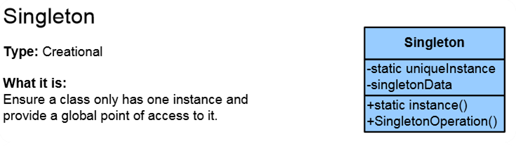
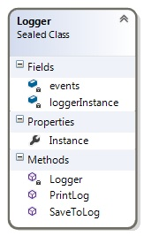

# Singleton Pattern

## Мотивация

**Singleton Pattern** е най-популярният **creational** шаблон. Чрез имплементирането на този шаблон се цели създаването само на един, единствен обект на конкретен клас и осъществяването на връзките между други(външни) обекти с обекта на Singleton класа.

## Цел
**Singleton Pattern** ни дава възможност за постигане на следните две цели:

* създаването на една единствена инстанция на даден клас;
* достъпване на тази инстанция.

## Приложение

**Singleton Pattern** се използва при моделиране на обекти, които имат само една инстанция в реалния свят. Така например, в клас *Logger* може да има само един обект за извеждане на някаква информация в лог-файл. В случай, че се допусне създаването на няколко такива обекта(логъра) те всички ще са референция към една и съща област в паметта. Например:

	public static class Program
    {
        public static void Main()
        {
            var log = Logger.Instance;
            log.SaveToLog("We have started with the introduction to design patters.");
            log.SaveToLog("Some other event.");

            var log2 = Logger.Instance;
            log2.SaveToLog("An event from log2... Mind = Blown!");

            log.PrintLog();

            Console.WriteLine(log == log2); // true

        }
    }

Въпреки че сме "инстанцирали" два обекта от клас Logger, те на практика са референциии към един и същ обект, и водят към една и съща част от паметта. 

## Известни употреби

**Singleton Pattern** се изпозлва в следните случаи:

+  при дизайн на *Logger* класове;
+  при дизайн на *Configuration* класове;
+  при достъп до споделени ресурси (напр. сериен порт);
+  в комбинация с Abstract Factory или Factory Method шаблоните, при тяхното използване в многонишкова среда.

## Имплементация

**Singleton Pattern** се **имплементира** чрез статично поле в което пазим инстанцията на класа, конструктор - задължително е използването на модификатор - private и публичен метод(Java) или публично пропърти(C#), които връща референция към static полето.

	public sealed class Logger
    {
        private static Logger loggerInstance;

        private readonly List<LogEvent> events = new List<LogEvent>();

        // It is important constructor to be private

        private Logger()
        {
        }

        public static Logger Instance
        {
            get
            {
                if (loggerInstance == null)
                {
                    loggerInstance = new Logger();
                }

                return loggerInstance;
            }
        }

    }

При имплементацията на Singleton Pattern **участват** Singleton класа и клиента.

* *Singleton класа* дефинира метод, който дава възможност за достъп до неговата уникална инстанция. Инстанцирането се реализира като static метод, който отговаря за създаването на единствена инстанция на класа.
* *Клиентът* получава достъп до Singleton класа, единствено чрез неговия static метод.

## Последствия
**Последствията** от използването на Singleton Pattern са:

* осигуряване на контролиран достъп на клиентите до единствената инстанция на Singleton класа;
* разширяване функционалността в сравнение с глобалните променливи;
* възможност за наследяване и разширяване функционалността на Singleton класа;

## Проблеми

**Singleton Pattern** показва сериозна слабост при работа в многонишков режим.
 
	public class Singleton {
	    private static Singleton instance;

	    // Note: Constructor is 'protected' or 'private'
	    protected Singleton() { }

	    public static Singleton Instance() { // Can be property
	        // Use 'Lazy initialization'
	        if (instance == null) {
	            instance = new Singleton();
	        }

	        return instance;
	    }
	} // This implementation is not thread-safe!

Тези проблеми се решават чрез имплементиране на thread-safe вариант на шаблона, чрез използване на lock фунцкионалността на C#. Например:

	public static DoubleLockingThreadSafeLogger Instance
        {
            get
            {
                if (logger == null)
                {
                    lock (syncLock)
                    {
                        if (logger == null)
                        {
                            logger = new DoubleLockingThreadSafeLogger();
                        }
                    }
                }

                return logger;
            }
        }

По този начин си гарантираме "заключване" на инстанциирането до завършване на работата на всяка нишка.

**Известни слабости** на Singleton шаблона:

* Нарушава **Single Responsibility Principle** поради вменените му две функционалности - да създаде инстанция и да се грижи за нея(осигурява достъпа до нея)
* Получава се tight-coupling между класовете, които използват Singleton класа.
* Singleton класа е труден за тестване

