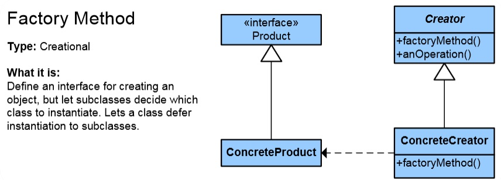
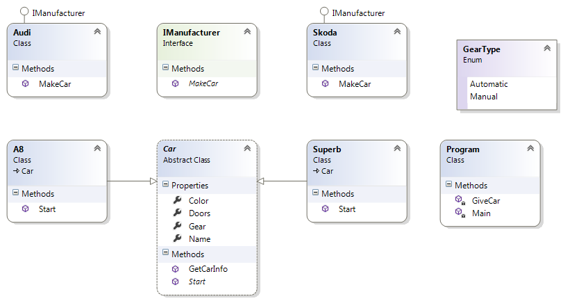

# Factory Method Pattern

## Мотивация

Необходимостта от повишаване на абстракцията при използване на Simple Factory.

## Цел

**Factory Method** шаблона дефинира абстрактен клас за създаване на обекти от друг клас, но избора на конкретен тип на обекта, който трябва да бъде създаден се прави от други класове по време на изпълнение на приложението.

**Factory Method** шаблона отговаря на необходимостта от интерфейс за създаване на различни обекти, като конкретния тип на инстанцирания обект се избира в зависимост от заявката на друг клас. Новосъздадените обекти се реферират чрез общ интерфейс.

## Приложение

При имплементацията на Factory Method шаблона имаме:

* Интерфейс Product - дефинира абстракцията за обектите, които се създават от Factory метода;
* ConcreteProduct - клас имплементиращ Product абстракцията;
* Creator - абстракция на логика за създаване на обекти;
* ConcreteCreator - имплементира абстракцията Creator.

Взаимодействието се осъществава между конкретните класове, имплементиращи абстракциите.

## Известни употреби

По известни употреби на **Factory Method** шаблона са:

* В ADO.NET, IDbCommand.CreateParameter е пример за използване на шаблона с цел да се свържат паралелни класови йерархии.
* В Qt, QMainWindow::createPopupMenu е  **Factory Method** деклариран във фреймуърк, който може да бъде овъррайднат в аплике;шън частта.

## Имплементация

// Интерфейс Creator

	public interface IManufacturer
    {
        Car MakeCar();
    }

// Клас ConcreteCreator

	public class Audi: IManufacturer
    {
        public Car MakeCar()
        {
            Car a8 = new A8 { Color = "Red", Doors = 5, Gear = GearType.Automatic, Name = "Audi A8" };
            return a8;
        }
    }

// Клас ConcreteCreator

	public class Skoda: IManufacturer
    {
        public Car MakeCar()
        {
            Car superb = new Superb { Color = "Black", Doors = 5, Gear = GearType.Manual, Name = "Skoda Superb"};

            return superb;
        }
    }

// Абстрактен клас Product

	public abstract class Car
    {
        public string Name { get; set; }

        public string Color { get; set; }

        public GearType Gear { get; set; }

        public int Doors { get; set; }

        public abstract void Start();

        public void GetCarInfo()
        {
            StringBuilder carInfo = new StringBuilder();

            carInfo.AppendFormat("Car Name: " + this.Name);
            carInfo.AppendLine();
            carInfo.AppendFormat("Car Color: " + this.Color);
            carInfo.AppendLine();
            carInfo.AppendFormat("Car Gears type: " + this.Gear);
            carInfo.AppendLine();
            carInfo.AppendFormat("Car Doors number: " + this.Doors);
            carInfo.AppendLine();

            Console.WriteLine(carInfo.ToString());
        }
    }

// Конкретен клас наследник на Product- абстракцията

	class Superb:Car
    {
        public override void Start()
        {
            Console.WriteLine("Superb starts its engine");
        }
    }

// Конкретен клас наследник на Product- абстракцията

	public class A8: Car
    {
        public override void Start()
        {
            Console.WriteLine("A8 starts its engine");
        }
    }

// Клиентска част

        static void Main()
        {
            // direct invoking of the manufacturer class
            IManufacturer skodaManufacturer = new Skoda();
            Car skodaCar = skodaManufacturer.MakeCar();
            skodaCar.GetCarInfo();
            skodaCar.Start();
            Console.WriteLine(new string('-', 60));

            // Using Factory method GiveCar
            GiveCar(new Audi());
            Console.WriteLine(new string('-', 60));

            GiveCar(new Skoda());
            Console.WriteLine(new string('-', 60));

            // Using Reflection
            Console.WriteLine("Using Reflection!!!!!!!!!!!!!!!!!!");
            var factoryClassName = ConfigurationManager.AppSettings["ManufacturerFactory"];
            var manufacturer =
                Assembly.GetExecutingAssembly()
                .CreateInstance(factoryClassName) as IManufacturer;
            GiveCar(manufacturer);
            Console.WriteLine(new string('-', 60));
        }

        private static void GiveCar(IManufacturer manufacturer)
        {
            Car someCar = manufacturer.MakeCar();
            someCar.GetCarInfo();
            someCar.Start();
        }

// Резултат:

	Car Name: Skoda Superb
	Car Color: Black
	Car Gears type: Manual
	Car Doors number: 5
	
	Superb starts its engine
	------------------------------------------------------------
	Car Name: Audi A8
	Car Color: Red
	Car Gears type: Automatic
	Car Doors number: 5
	
	A8 starts its engine
	------------------------------------------------------------
	Car Name: Skoda Superb
	Car Color: Black
	Car Gears type: Manual
	Car Doors number: 5
	
	Superb starts its engine
	------------------------------------------------------------
	Using Reflection!!!!!!!!!!!!!!!!!!
	Car Name: Audi A8
	Car Color: Red
	Car Gears type: Automatic
	Car Doors number: 5
	
	A8 starts its engine
	------------------------------------------------------------

## UML Клас-диаграма

В случая skodaManufacturer(инстанция на производителя Skoda) ще произведе това, което му укаже класа Car. Същият производител, може да произведе и нещо което му укаже някакъв друг, хипотетичен клас, например Bicycle. Ето защо казваме, че класът който създава(Creator класа) не може да предположи, какъв клас обект се очаква да бъде създаден. Product класа му указва какъв тип обект да създаде.

## Последствия
Factory Method шаблона се прилага в случаите, в които класа, създаващ обекти, не може да предположи, какъв клас обект се очаква да бъде създаден. Единствено класа, който прави заявка за създаване на обект може да укаже неговия тип.

В следствие използването на Factory Method шаблона постигаме:

* Отпада необходимостта от свързване на приложението с конкретни класове. Кодът използва единствено Product интерфейса, което прави възможна работата му с много различни ConcreteProduct класове.

* Постигаме спазване на Open/Close принципа. Винаги можем да добавим нов продукт и нов производител.

