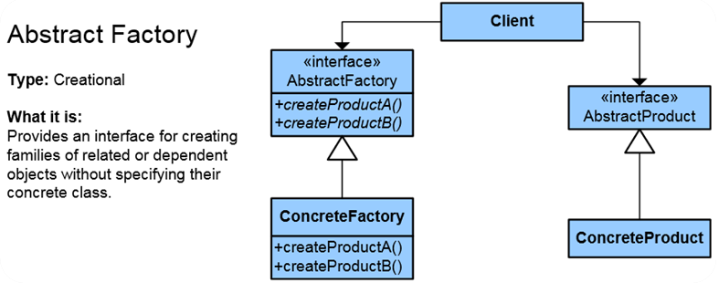
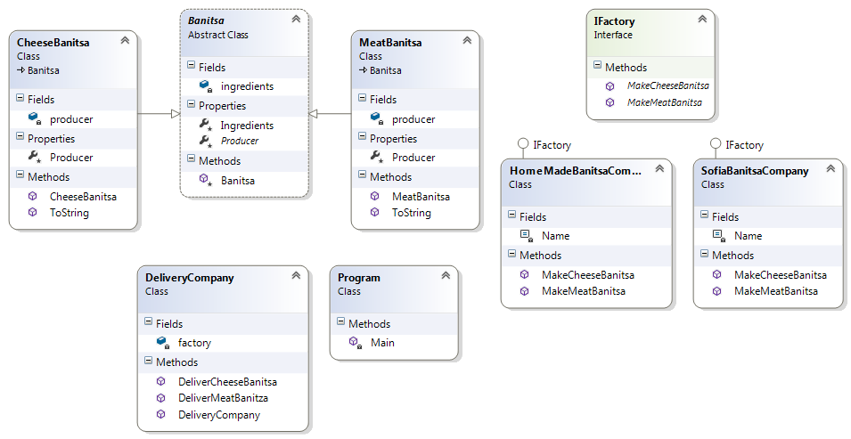

# Abstract Factory Pattern

## Мотивация

Създаване на множество(йерархия, библиотека от класове), някаква съвкупност от свързани, зависими обекти.

## Цел

Дефинира интерфейс за създаване на множество от свързани обекти, без да специфицира техният конкретен клас.

## Приложение

* Използва се в системи, които често се променят.
* Осигурява лесен механизъм за подмяна на различни набори от обекти.

Клиентът взаимодейства с абстракциите(на диаграмата интерфейсите) AsbtractFactory и AbstractProduct. Те, от своя страна, имат свои конкретни имплементации.

## Известни употреби
// TODO

## Имплементация

// Абстрактен клас(**AbstractProduct**)

	public abstract class Banitsa
    {
        private readonly IList<string> ingredients;

        protected Banitsa(IEnumerable<string> ingredients)
        {
            this.ingredients = new List<string>(ingredients);
        }

        protected IList<string> Ingredients
        {
            get
            {
                return this.ingredients;
            }
        }

        protected abstract string Producer { get; }
    }

// Клас наследник

	public class CheeseBanitsa : Banitsa
    {
        private string producer;

        public CheeseBanitsa(IEnumerable<string> ingredients, string producer):
            base(ingredients)
        {
            this.producer = producer;
        }

        protected override string Producer
        {
            get
            {
                return this.producer;
            }
        }

        public override string ToString()
        {
            // some logic;
        }
    }

// Интерфейс (**AbstractFactory**)

	public interface IFactory
    {
        CheeseBanitsa MakeCheeseBanitsa();

        MeatBanitsa MakeMeatBanitsa();
    }

// Конкретен клас имплементатор **ConcreteFactory**

	public class SofiaBanitsaCompany : IFactory
    {
        private const string Name = "Sofiiska Banitsa";

        public CheeseBanitsa MakeCheeseBanitsa()
        {
            IEnumerable<string> ingredients = new List<string>{
                "eggs", "milk", "cheese", "butter"
            };

            CheeseBanitsa cheeseBanitsa = new CheeseBanitsa(ingredients, Name); // TODO Why can't use the abstraction Banitsa

            return cheeseBanitsa;
        }

        public MeatBanitsa MakeMeatBanitsa()
        {
            IEnumerable<string> ingredients = new List<string>{
                "meat", "eggs", "onion"
            };

            MeatBanitsa meatBanitsa = new MeatBanitsa(ingredients, Name);

            return meatBanitsa;
        }
    }

// Клиентска част

	IFactory sofiaCompany = new SofiaBanitsaCompany(); // Working with the abstraction(the interface)

    Banitsa sofiaCheese = sofiaCompany.MakeCheeseBanitsa(); // Working with the abstraction(the abstract class Banitsa)
    Console.WriteLine("Directly delivered banitsa: " + sofiaCheese);

* Клас-диаграма:

## Последствия
// TODO

## Проблеми
// TODO

