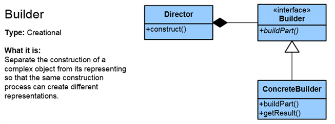
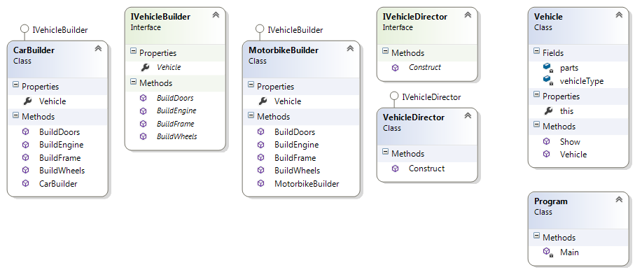

# Builder Pattern

## Мотивация

Необходимостта от отделяне на логиката по създаването(конструирането) на сложен обект от логиката на неговата същност и енкапсулиране на логиката по създаването му.

## Цел

 * Служи за  създаване на обекти, при които е важна последователността на инициализиране на различните компоненти на обекта. 
 * В общия случай различните компоненти са взаимно зависими, което налага определена последователност при създаването им. 
 * Създаването на различните компоненти се осъществява чрез методи, които са дефинирани в интерфейс. Това позволява на всеки наследник на съответния интерфейс да имплементира по свой начин създаването на компонентите. 
 * Следващата стъпка е създаването на клас, който определя необходимите компоненти и последователността на създаването им. 
 * Това означава, че както можем да имаме различни имплементации на методологиите за създаване на компоненти, така можем да имаме и различни имплементации за композирането им.
 
## Приложение

Приложим е при имплементиране на класове, които са със сродни функционалности.

В класът Director се пази логиката за последователността на стъпките по създаването на обекта, но той не знае какво точно прави всяка стъпка. Интерфейсът Builder дефинира стъпките за създаване на обекта. Какво прави всяка стъпка(каква логика имплементира) се пази в ConcreteBuilder, който е имплементация на интерефейсът Builder. Director дипендва на абстракцията Builder, като в метода Construct() подаваме като параметър IBuilder.

Клиентът работи с ConcreteBuilder и с Director за да създаде продукт. Всички продукти са от един тип(автомобил) но притежават различни данни(бензинов, дизелов, пет врати, шест врати и т.н.)

 	    
## Известни употреби
* конструирането на HTML или XML документи
* Забележка: StringBuilder не позлва Builder pattern, просто е съвпадение на темрините.

## Примерна имплeментация 

Искаме да имплементираме няколко класа които се занимават с производство на различни превозни средства. Всички те, могат да наследяват абстрактен клас VehicleBuilder. В отделен Product клас отделяме функционалността по съставянето на Vehicle обект.

// Абстракция Builder

	public interface IVehicleBuilder
    {
        Vehicle Vehicle { get; set; }

        void BuildFrame();

        void BuildEngine();

        void BuildWheels();

        void BuildDoors();
    }

//Клас ConcreteBuilder

	public class CarBuilder : IVehicleBuilder
    {
        public CarBuilder()
        {
            this.Vehicle = new Vehicle("Car");
        }

        public Vehicle Vehicle { get; set; }

        public void BuildFrame()
        {
            this.Vehicle["frame"] = "steel car frame";
        }

        public void BuildEngine()
        {
            this.Vehicle["engine"] = "2500 diezel engine";
        }

        public void BuildWheels()
        {
            this.Vehicle["wheels"] = "4 wheels";
        }

        public void BuildDoors()
        {
            this.Vehicle["doors"] = "5 doors";
        }
    }

// Клас Director(в случая имплементира някаква абстракция, в случай, че искаме да направим повече от един Director)

	public class VehicleDirector : IVehicleDirector
    {
        public void Construct(IVehicleBuilder builder)
        {
            builder.BuildFrame();
            builder.BuildEngine();
            builder.BuildWheels();
            builder.BuildDoors();
        }
    }

// Продуктов клас

	public class Vehicle
    {
        private readonly string vehicleType;
        private readonly Dictionary<string, string> parts;

        public Vehicle(string vehicleType)
        {
            this.vehicleType = vehicleType;
            this.parts = new Dictionary<string, string>();
        }

        public string this[string key]
        {
            get
            {
                return this.parts[key];
            }
            set
            {
                this.parts[key] = value;
            }
        }

        public void Show()
        {
            Console.WriteLine("---------------------------");
            Console.WriteLine("Vehicle Type: {0}", this.vehicleType);
            Console.WriteLine(" Frame  : {0}", this["frame"]);
            Console.WriteLine(" Engine : {0}", this["engine"]);
            Console.WriteLine(" Wheels: {0}", this["wheels"]);
            Console.WriteLine(" Doors : {0}", this["doors"]);
        }
    }

// Клиентски клас

	IVehicleDirector director = new VehicleDirector();

    IVehicleBuilder bikeBuilder = new MotorbikeBuilder();
    director.Construct(bikeBuilder);
    bikeBuilder.Vehicle.Show();

    IVehicleBuilder carBuilder = new CarBuilder();
    director.Construct(carBuilder);
    carBuilder.Vehicle.Show();

// Резултат

	---------------------------
	Vehicle Type: Motorbike
	 Frame  : alloy bike frame
	 Engine : 250cc two-stroke engine
	 Wheels: 2 wheels
	 Doors : 0 doors
	---------------------------
	Vehicle Type: Car
	 Frame  : steel car frame
	 Engine : 2500 diezel engine
	 Wheels: 4 wheels
	 Doors : 5 doors

## UML  клас-диаграма

## Последствия
* Дава ясна представа какво трябва да се имплементира от клиента 
* Осигурява цялостния модел на обекта
* Има много ясно разделение на логиката по създаване на обект от данните на обекта- Separation of Concernes принцип.
* Може да се комбинират различни Director с различни ConcreteBuilder.

## Сродни модели
* Factory method
* Abstract Factory

## Проблеми
* Създава сложен обект, който ако не удовлетворява изискванията на повече от един ползвател, е безпредметно да се използва. С други думи, ако кодът, който ни създава обект няма никаква перспектива да се използва за създаване на други обекти, съставени от същите компоненти, нямаме нужда от него. По-просто би било да създадем логиката за създаване на обекта в самия клас, който го представлява.

## Съпоставка между Factory patterns и Builder pattern

* **Factory Method** - Използваме го когато можем лесно да създадем целият обект викайки един един метод. Използваме общ интерфейс за няколко различни "фабрики"(ConcreteCreator класове).

* **Abstract Factory** - Използваме го когато искаме да имплементираме интерфейс за създаване на семейства от взаимосвързани обекти.

* **Builder** - когато имаме нужда от повече неща за да създадем обект и когато стъпките по създаването му са в точно определена последователност.

