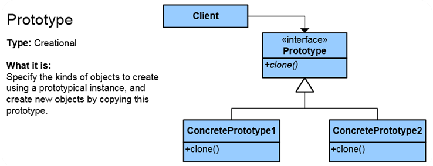
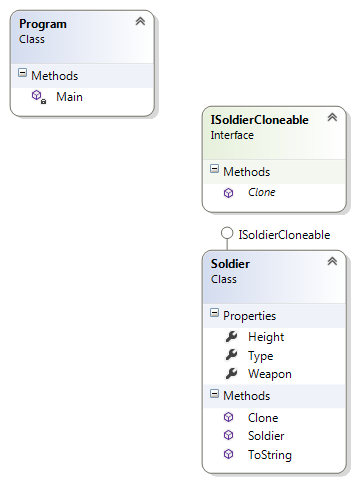

# Prototype Pattern

## Мотивация

Необходимост от клониране на вече създадени обекти.
 
## Цел

 * Създаване нови обекти като клонира вече създадени такива. Използва се най-вече в случаите в които създаването на нов обект използва много повече ресурси, отколкото клонирането на същия обект.
 * Избягваме употребата на думата "new"( "**new is glue**").
 * При класове, които се инстанцират по време на изпълнение на програмата.
 * Използва се и за копиране(взимане) на моментното/текущото състоянието на даден обект, с цел да го запазим някъде в паметта, при условие, че този обект ще се променя с течение на изпълнението на кода. 

## Приложение

Имаме интерфейс Prototype, с който взаимодейства клиента. Този интерфейс има метод Clone(), който връща обект от указаният в декларацията на метода тип. В .NET Clone() връща object(виж по-долу Проблеми). Интерфейсът може да има няколко различни конкретни имплементационни класове.

## Известни употреби
* В .NET интерфейса ICloneable е имплементация на Prototype интерфейса. Той съдържа метод Clone(), който връща обект от тип object.

## Имплементация

// Интерфейс

	public interface ISoldierCloneable
    {
        Soldier Clone();
    }

// Клас имплементиращ интерфейса

	public class Soldier : ISoldierCloneable
    {
        public string Type { get; set; }

        public int Height { get; set; }

        public string Weapon { get; set; }

        public Soldier(string type, int height, string weapon)
        {
            Thread.Sleep(3000); // simulating slow instanciating object
            this.Type = type;
            this.Height = height;
            this.Weapon = weapon;
        }

        public Soldier Clone()
        {
            // Options of cloning in .NET (http://stackoverflow.com/a/966534/1862812)
            // Clone Manually - Tedious, but high level of control
            // Clone with MemberwiseClone - Fastest but only creates a shallow copy, i.e. for reference-type fields the original object and it's clone refer to the same object.
            // Clone with Reflection - Shallow copy by default, can be re-written to do deep copy. Advantage: automated. Disadvantage: reflection is slow.
            // Clone with Serialization - Easy, automated. Give up some control and serialization is slowest of all.

            return this.MemberwiseClone() as Soldier; // this will make shallow copy

            //return new Soldier(this.Type, this.Height, this.Weapon); // this doesn't solve the main problem - the resource waisting
            //return new Soldier(this.Type.Clone() as string, this.Height, this.Weapon); // full deep copy - the resource waisting stays unsolved

        }

        public override string ToString()
        {
            return string.Format("Soldier type: {0}, height: {1}, weapon: {2}", this.Type, this.Height, this.Weapon);
        }
    }

// Клиентска част

    static void Main()
    {
        Soldier marine = new Soldier("Marine", 190, "AK-47");
        //Soldier cannonier = new Soldier("Cannonier", 180, "RPG");

        Soldier marine2 = marine.Clone();
        marine2.Weapon = "Mauser";

        Console.WriteLine(marine.ToString());
        Console.WriteLine(marine2.ToString());
    }

// Резултат

	Soldier type: Marine, height: 190, weapon: AK-47
	Soldier type: Marine, height: 190, weapon: Mauser

## UML клас-диаграма

## Последствия
* Спестява потенциално скъпи ресурси за създаване на нови обекти.
* Скрива комплексната логика по създаването на обект и така улеснява значително  клиента по създаването на нови обекти.
* Можем да скрием конструктора на даден клас с класификатор private/internal и да предоставим на клиента възможността само да клонира вече създадени(няколко) обекта.

## Сродни модели
* Memmento(по отношение на запазването на текущото състояние на даден обект, например нивото на играта)

## Проблеми

* Използването на .NET имплементацията на интерфейса за този шаблон(ICloneable)ни задължава да имплементираме неговият метод Clone(). Този метод връща тип object. Необходимо е допълнително кастване на обекта тип object към конкретен тип, който искаме да получим, с потенциалните проблеми произтичащи от това.
* Когато използваме методът 'MemberwiseClone()', при клониране на референтни типове, реално се копира референцията им, в резултат на което получаваме 'shallow copy'. Този проблем е добре известен и съществуват множество от решения за имплементиране на deep copy начин за клониране. Идеята е да се клонира напълно всеки тип, включително и референтните типове съставящи даден обект.
