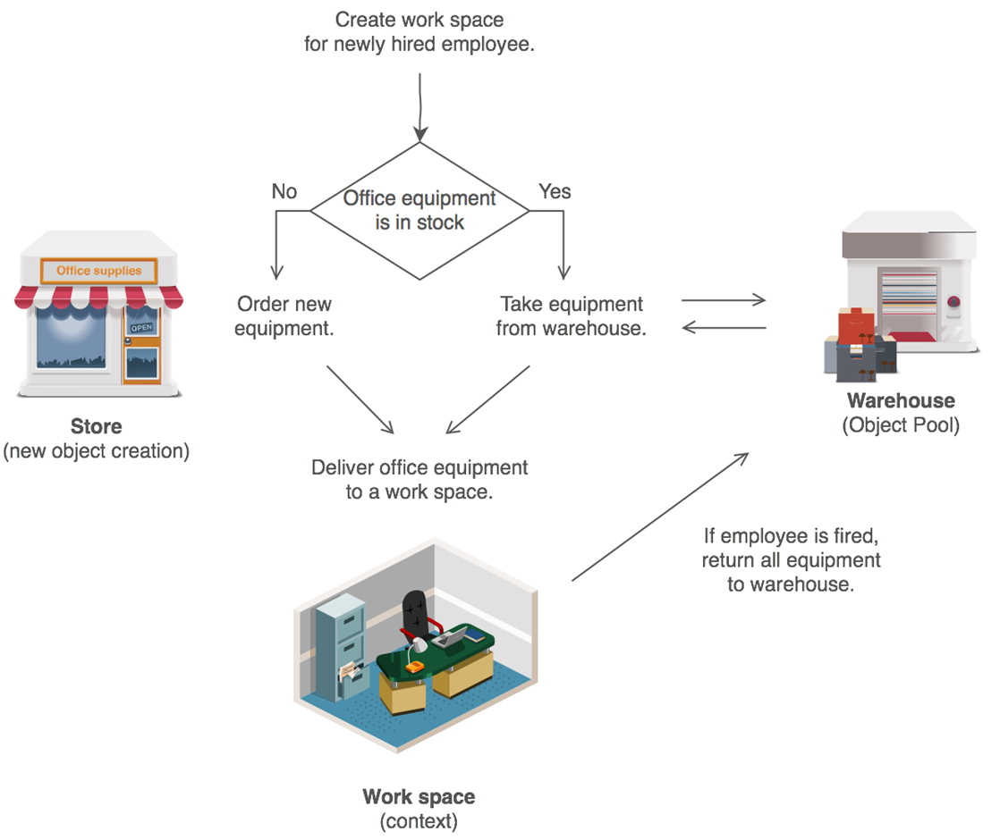

# Object Pool Pattern

## Мотивация

Необходимостта от преизползване на обект за чието създаване се отнемат много ресурси.

## Цел
* Да се преизползва вече създаден обект. Обектът вече е създаден, бил е използван, необходимостта от него е отпаднала, но вместо да го изтрием, ние го "складираме" с цел в някакъв бъдещ момент да го преизползваме.

## Приложение

Принципна схема:

## Известни употреби

* Unity 3D връща обектите в първоначалното им положение, вместо да ги унищожава и да ги създава наново.
* ADO.NET използва **connection pooling** защото отварянето на нова конекция е скъпо.

## Имплементация

// Клас на обекта който ще бъде съхраняван в pool

	public class Tool : IDisposable
    {
        private readonly DateTime timeofOrder = DateTime.Now;

        public DateTime TimeOfOrder
        {
            get
            {
                return this.timeofOrder;
            }
        }

        public string WorkerName { get; set; }

        public string ToolType { get; set; }

        public void Dispose()
        {
            this.WorkerName = null;
        }
    }

// Класът pool в който ще се съхраняват обектите. Класът е темплейтен, така, че ако искаме да можем да му подадем обекти от друг, различен от Tool тип.

	public class ToolDepot<T> where T: IDisposable, new()
    {
        public readonly List<T> availableTools = new List<T>();
        public readonly List<T> usedTools = new List<T>();

        public ToolDepot()
        {
        }

        public T GetTool()
        {
            lock (this.availableTools)
            {
                if (this.availableTools.Count != 0)
                {
                    T tool = this.availableTools[0];
                    this.usedTools.Add(tool);
                    this.availableTools.Remove(tool);
                    //this.availableTools.RemoveAt(0); // Check for the proper use of Remove
                    
                    return tool;
                }
                else
                {
                    T tool = new T();
                    this.usedTools.Add(tool);

                    return tool;
                }
            }
        }

        public void ReleaseTool(T tool)
        {
            tool.Dispose();

            lock (this.availableTools) // may be this.usedTools is more proper?
            {
                this.availableTools.Add(tool);
                this.usedTools.Remove(tool);
            }
        }

    }

// Клиентска част

    ToolDepot<Tool> warehouse = new ToolDepot<Tool>();

    Tool hammer = warehouse.GetTool();
    hammer.ToolType = "Hammer";
    hammer.WorkerName = "Pesho Goshov";
    Console.WriteLine("Tool type: {0}, orderd by: {1}, ordered at: {2:MM/dd/yyyy hh:mm:ss.fff tt}", hammer.ToolType, hammer.WorkerName, hammer.TimeOfOrder);

    Tool screwdriver = warehouse.GetTool();
    screwdriver.ToolType = "Screwdriver";
    screwdriver.WorkerName = "Tosho Dimitrov";
    Console.WriteLine("Tool type: {0}, orderd by: {1}, ordered at: {2:MM/dd/yyyy hh:mm:ss.fff tt}", screwdriver.ToolType, screwdriver.WorkerName, screwdriver.TimeOfOrder);

    CheckForToolsInUse(warehouse.usedTools);

    Console.WriteLine("Realeasing hammer!");
    warehouse.ReleaseTool(hammer);
    CheckForAvailableTools(warehouse.availableTools);

    Console.WriteLine("Releasing screwdriver");
    warehouse.ReleaseTool(screwdriver);
    CheckForAvailableTools(warehouse.availableTools);
    
// Резултат:

	Tool type: Hammer, orderd by: Pesho Goshov, ordered at: 09.21.2015 02:32:39.707
	Tool type: Screwdriver, orderd by: Tosho Dimitrov, ordered at: 09.21.2015 02:32:39.730
	Tool in use now: Hammer
	Tool in use now: Screwdriver
	Realeasing hammer!
	Available tools: Hammer
	Releasing screwdriver
	Available tools: Hammer
	Available tools: Screwdriver
        
В случая ползвам два метода за проверка на съдържанието на списъка със свободните и със заетите инструменти, но те не представляват интерес.

## Последствия
* Спестяваме ресурси по създаването на нов обект. Това в някои случаи може драстично да повиши пърформанс на програмата, както е в случая с игрите при Unity 3D.

