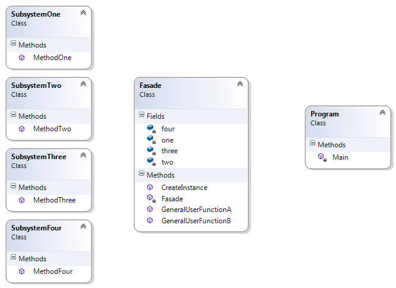

# Fasade Pattern

Терминът **"фасада"** е взаимстван от сферата на архитектурата и строителството. Фасадите на една сграда са външните стени на сградата. Освен конструктивната си роля да носят ерхитектурни елементи като топлинна изолация, прозорци, врати и други, те играят и чисто архитектурна роля, като "представят" сградата пред заобикалящата я среда и скриват вътрешността на сградата. Това, което виждат хората извън сградата, съответно начинът, по който възприемат сградата, се обуславя основно от фасадите на тази сграда. Начинът по който се достъпва сграда, чрез врати и прозорци, е функция на фасадата.

## Мотивация
Необходимостта от улесняване на достъпа на клиента до по-голяма функционалност на кода, например цяла една библиотека.
 
## Цел

**Fasade pattern** е class(или object), който улеснява достъпа на клиента, предоставяйки му опростен интерфейс, до по-голяма и по-сложна функционалност и набор от под-класове. Може да се каже, че **Fasade pattern** скрива голямата част от кода, вътрешността на кода, от клиента. 

## Известни употреби

* **Fasade pattern** е използван при много Win32 API базирани класове с цел да се скрие сложността на Win32 методите.
* При XmlSerializer (в .NET) и JSON serializer (в JSON.NET) скрива сложна имплементаци, включващата генериране на асемблита "on-the-fly" зад много лесен за използване клас.
* WebClient и File класовете са други примери за използване на този шаблон.

## Имплементация

// Имаме набор от подсистеми, всяка със своя функционалност

    public class SubsystemOne
    {
        public void MethodOne()
        {
            Console.WriteLine("MethodOne processing");
        }
    }

	.
	.
	.
	.

	public class SubsystemFour
    {
        public void MethodFour()
        {
            Console.WriteLine("MethodFour processing");
        }
    }

// Имаме Fasade клас, зад който ще "скрием" всички тези подсистеми.

	public class Fasade
    {
        private SubsystemOne one;
        private SubsystemTwo two;
        private SubsystemThree three;
        private SubsystemFour four;

        private Fasade()
        {
            one = new SubsystemOne();
            two = new SubsystemTwo();
            three = new SubsystemThree();
            four = new SubsystemFour();
        }

        public static Fasade CreateInstance()
        {
            return new Fasade();
        }

        public void GeneralUserFunctionA()
        {
            Console.WriteLine("GeneralUserFunctionA method calls ----");
            one.MethodOne();
            two.MethodTwo();
            four.MethodFour();
        }

        public void GeneralUserFunctionB()
        {
            Console.WriteLine("GeneralUserFunctionB method calls ----");
            one.MethodOne();
            two.MethodTwo();
            three.MethodThree();
            four.MethodFour();
            two.MethodTwo();
            one.MethodOne();
        }
    }

// Клиентската част е максимално опростена

	static void Main()
    {
        // Fasade fs = new Fasade(); // classic way with public Fasade class constructor

        Fasade fs = Fasade.CreateInstance(); // hiding Fasade instance creation, using Simple Factory pattern

        fs.GeneralUserFunctionA();
        fs.GeneralUserFunctionB();
    }

В случая дори инстанцирането на Fasade класа сме го скрили зад статичен метод CreateInstance(), имплементирайки някакво Simple Factory.

## UML- клас диаграма

Клиентският клас, в случая Program.cs има достъп само до класа Fasade, а той от своя страна има достъп до другите класове, като "скрива" тяхната функционалност и имплементация.

## Последствия

Чрез използване на **Fasade pattern** се постигат следните ефекти:

* Опростява се използването на дадена функционалност/библиотека.
* Намалява се зависимостите между външният и нашият код, спазвайки принципа **"principle of least knowledge"**([Закон на Demeter](https://en.wikipedia.org/wiki/Law_of_Demeter)), което води до "loose coupling" ефект.
* Скриваме(зад "фасада") лошо написан API, използвайки по-добре написани наши методи/класове.
* Предпазваме се от преизползване на код- това е допълнителен ефект от използването на шаблона
