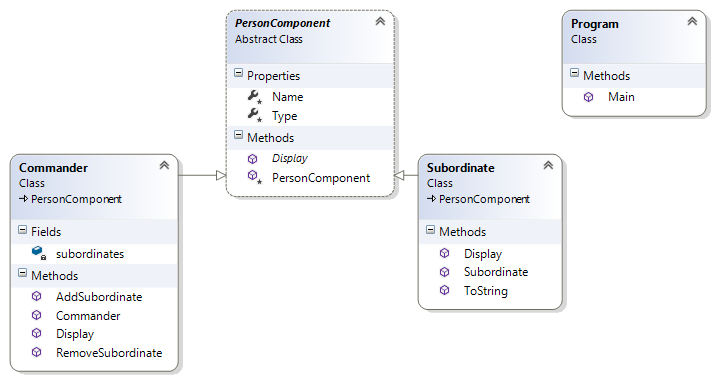

# Composite Pattern

## Мотивация
Необходимостта от комбиниране на различни типове обекти в дървовидна структура(йерархия).
 
## Цел

**Composite pattern** ни позволява да:

* Правим дървовидна структура от класове, които представляват различни типове обекти.
* Да третираме по един и същи начин както простите, така и композитните типове обекти.

## Приложение

Имаме интерфейс Component, който декларира всички функционалности, които трябва да притежават обектите. Този интерфейс се имплементира както от някакъв прост обект(Leaf) така и от композитен обект, който сам в себе си може да съдържа други обекти, било то прости или отново композитни.

## Известни употреби

**Composite pattern** е използван в .NET Framework при:

* Windows.Forms.Control и неговите класове-деривати(наследници).
* System.Web.UI.Control и неговите класове-деривати.
* System.Xml.XmlNode и неговите класове-деривати.

## Имплементация

Ще имплементирам дървовидна структура от прости и композитни елементи, представляващи командир/и и подчинен/и.

// Абстракция на Component

	public abstract class PersonComponent
    {
        protected PersonComponent(string name, string type)
        {
            this.Name = name;
            this.Type = type;
        }

        protected string Name { get; private set; }

        protected string Type { get; private set; }

        public abstract void Display(int tab); 
    }

// Имплементация на прост обект(Leaf), който наследява абстракцията.

	public class Subordinate : PersonComponent
    {
        public Subordinate(string name, string type)
            : base(name, type)
        {
        }

        public override void Display(int tab)
        {
            Console.WriteLine(new string('-', tab) + string.Format("Name: {0}, Type: {1}", this.Name, this.Type));
        }

        public override string ToString()
        {
            return string.Format("Name: {0}, Type: {1}", this.Name, this.Type);
        }
    }

// Имплементация на конкретен **композитен** обект(Composite), който наследява абстракцията Composite.

	public class Commander : PersonComponent
    {
        private readonly ICollection<PersonComponent> subordinates;

        public Commander(string name, string type)
            : base(name, type)
        {
            this.subordinates = new List<PersonComponent>();
        }

        public void AddSubordinate(PersonComponent subordinate)
        {
            this.subordinates.Add(subordinate);
        }

        public void RemoveSubordinate(PersonComponent subordinate)
        {
            this.subordinates.Remove(subordinate);
        }

        public override void Display(int tab)
        {
            Console.WriteLine(new string('-', tab) + string.Format("Name: {0}, Type: {1}", this.Name, this.Type));

            foreach (PersonComponent subordinate in this.subordinates)
            {
                subordinate.Display(tab + 4);
            }
        }
    }

// Клиентска част:

	public static void Main()
    {
        Commander topGeneral = new Commander("Dobry Djurov", "General of the Army");

        var subGeneralFirst = new Commander("Ivan Petrov", "Lieutenant General");
        var subGeneralSecond = new Commander("Georgy Ivanov", "Lieutenant General");

        topGeneral.AddSubordinate(subGeneralFirst);
        topGeneral.AddSubordinate(subGeneralSecond);

        Subordinate privateFirst = new Subordinate("Pesho Goshov", "Private");
        Subordinate privateSecond = new Subordinate("Tosho Peshov", "Private");
        Subordinate privateWounded = new Subordinate("Dimo Todorov", "Private");

        subGeneralFirst.AddSubordinate(privateFirst);
        subGeneralFirst.AddSubordinate(privateSecond);
        subGeneralFirst.AddSubordinate(privateWounded);

        Subordinate privateThird = new Subordinate("Sasho Ivanov", "Private");
        Subordinate privateFourth = new Subordinate("Joro Dimitrov", "Private");

        subGeneralSecond.AddSubordinate(privateThird);
        subGeneralSecond.AddSubordinate(privateFourth);

        topGeneral.Display(1);

        Console.WriteLine(new string('*', 30) + " The battle starts " + new string('*', 30));

        Console.WriteLine("The soldier: " + privateWounded.ToString() + " has been wounded and is sent to hospital");
        subGeneralFirst.RemoveSubordinate(privateWounded);

        topGeneral.Display(1);
    }

// Резултат(ясно се вижда йерархията):

		-Name: Dobry Djurov, Type: General of the Army
		-----Name: Ivan Petrov, Type: Lieutenant General
		---------Name: Pesho Goshov, Type: Private
		---------Name: Tosho Peshov, Type: Private
		---------Name: Dimo Todorov, Type: Private
		-----Name: Georgy Ivanov, Type: Lieutenant General
		---------Name: Sasho Ivanov, Type: Private
		---------Name: Joro Dimitrov, Type: Private
		****************************** The battle starts ******************************
		The soldier: Name: Dimo Todorov, Type: Private has been wounded and is sent to hospital
		-Name: Dobry Djurov, Type: General of the Army
		-----Name: Ivan Petrov, Type: Lieutenant General
		---------Name: Pesho Goshov, Type: Private
		---------Name: Tosho Peshov, Type: Private
		-----Name: Georgy Ivanov, Type: Lieutenant General
		---------Name: Sasho Ivanov, Type: Private
		---------Name: Joro Dimitrov, Type: Private

## UML диаграма

PersonComponent е абстрактният Component class(в случая не използваме интерфейс а абстрактен клас). Той се наследява от Subordinate и от Commander. Commander пази в полето си subordinates списък с подчинени Subordinates и подчинени Commander-s(със свои подчинени Subordinates) - т.е. имаме класическа йерархична структура.

