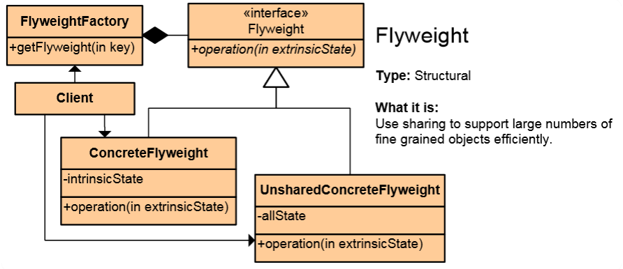
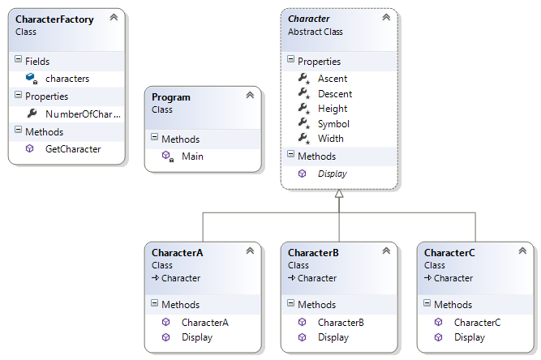

# Flyweight Pattern

## Мотивация

Необходимостта от оптимизация на използваните ресурси, най-вече на памет

## Цел

* Паметта използвана от един обект да се **споделя** и с други обекти.
* Създаваме някакъв сложен обект. При създаване на нов(подобен) обект му подаваме разликите със сложният обект, а приликите ги споделяме между двата обекта.

## Приложение

Всеки **Flyweight** обект има **споделена(intrinsic)** и **несподелена(extrinsic)** памет. Несподелената памет, всъщност ще подаваме като параметър, при работата с конкретният Flyweight обект.

На диаграмата имаме интерфейс **Flyweight**, който задава операция, която е несподелена. Имаме конкретна имплементация ConcreteFlyweight, която има споделено пропърти и имплементира несподелен метод, като несподелените ресурси ги подаваме като параметри на този метод. Т.е. ConcreteFlyweight вместо да пази и общите(intrinsicState) и различните(extrinsicState) данни, той пази само общите, а различните ги получава като параметър на метода си.

На диаграмата е представен и UnsharedConcreteFlyweight обект, който също имплементира интерфейса, но пази цялата информация.

Клиента работи чрез FlyweightFactory клас, който се занимава с поддръжката на конкретните Flyweight инстанции.

## Известни употреби

* String.Intern проверява дали някакъв стринг вече не съществува някъде, и ако се съществува го използва, вместо да създава нов.

## Имплементация

// Абстрактен клас Flyweight

	public abstract class Character
    {
        protected char Symbol { get; set; }

        protected int Width { get; set; }

        protected int Height { get; set; }

        protected int Ascent { get; set; }

        protected int Descent { get; set; }

        public abstract void Display(int pointSize);
    }

// Няколко конкретни наследника(CharacterA, CharacterB, CharacterC) на абстрактният клас. В случая **extrinsic state** е параметърът pointSize, който подаваме на метода Display().

    public class CharacterA : Character
    {
        public CharacterA()
        {
            this.Symbol = 'A';
            this.Height = 100;
            this.Width = 70;
            this.Ascent = 5;
            this.Descent = 0;
        }

        public override void Display(int pointSize)
        {
            Console.WriteLine("{0} (point size {1})", this.Symbol, pointSize);
        }
    }

// Клас FlyweightFactory

    public class CharacterFactory
    {
        private readonly Dictionary<char, Character> characters = new Dictionary<char, Character>();

        public int NumberOfCharacters
        {
            get
            {
                return this.characters.Count;
            }
        }

        public Character GetCharacter(char key)
        {
            Character character = null;

            //Using Lazy initialization
            if (this.characters.ContainsKey(key))
            {
                character = this.characters[key];
            }
            else
            {
                switch (key)
                {
                    case 'A':
                        character = new CharacterA(); break;
                    case 'B':
                        character = new CharacterB(); break;
                    case 'C':
                        character = new CharacterC(); break;
                    default:
                        throw new ArgumentOutOfRangeException();
                }

                this.characters.Add(key, character);
            }

            return character;
        }
    }

// Клиентска част

	static void Main()
    {
        string text = "ABCAABB";

        CharacterFactory characterFactory = new CharacterFactory();

        //  extrinsic state
        int pointSize = 10;

        // For each character use a flyweight object
        foreach (char symbol in text)
        {
            pointSize++;
            Character character = characterFactory.GetCharacter(symbol);
            character.Display(pointSize);
        }

        Console.WriteLine("Total number of characters in the object: {0}", characterFactory.NumberOfCharacters);
    }

// Резултат

	A (point size 11)
	B (point size 12)
	C (point size 13)
	A (point size 14)
	A (point size 15)
	B (point size 16)
	B (point size 17)
	Total nuumber of characters in the object: 3

## UML клас-диаграма

## Последствия

* Намалява **storage costs** при създаване на множество обекти.
* Споделяне на обекти, за да могат да бъдат използвани в различни контексти.
* Минимизира паметта, която използваме, чрез споделяне на колкото се може повече данни с други подобни обекти. 

