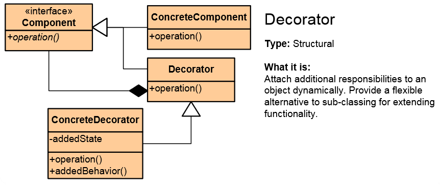
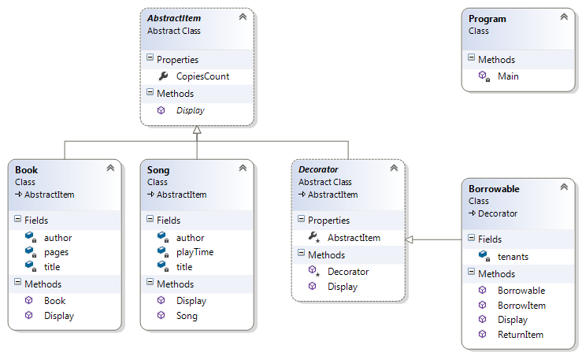

# Decorator Pattern

## Мотивация

Необходимостта от добавяне на функционалност към вече съществуващ обект.

## Цел

* Run-time wrapping на оригиналният обект и добавяне на нова функционалност.
* Освен да добавя нова функционалност, новият обект пази и инстанция на оригиналният. За разлика от Proxy pattern, при който proxy обекта наследява оригиналният обект, или имплементира неговата абстракция.

## Приложение

Класовете ConcreteComponent и Decorator имплементират една и съща абстракция Component. ConcreteDecorator наследява Decorator, съответно можем да имаме много ConcreteDecorator-и. ConcreteDecorator реално добавят и/или овъррайдват функционалност на Component.

## Известни употреби
Прилага се най-вече в legacy системи.
* Добавя функционалност на UI контролите.
* Разширява функционалността на sealed класове.
* В .NET: CryptoStream и GZipStream декорират Stream класа.
* В .NET при UI контролите при WPF, Decorator клас осигурява базов клас да прилага елементи за различни ефекти върху някакъв child елемент, като например Border или Viebox.

## Имплементация

// Абстрактен клас Component

    internal abstract class AbstractItem
    {
        public int CopiesCount { get; set; }

        public abstract void Display();
    }

// Класове Song и Book, които наследяват абстракцията и се явяват ConcreteComponent класове, по смисъла на принципната клас диаграма.

	public class Song : AbstractItem
    {
        private readonly string author;
        private readonly string title;
        private readonly int playTime;

        public Song(string author, string title, int copies, int playTime)
        {
            this.author = author;
            this.title = title;
            this.CopiesCount = copies;
            this.playTime = playTime;
        }

        public override void Display()
        {
            Console.WriteLine("Song: {0}", this.title);
            Console.WriteLine("Author: {0}", this.author);
            Console.WriteLine("Number of copies: {0}", this.CopiesCount);
            Console.WriteLine("Playtime: {0}", this.playTime);
        }
    }

// Клас Book

	public class Book : AbstractItem
    {
        private readonly string author;
        private readonly string title;
        private readonly int pages;

        public Book(string author, string title, int copies, int pages)
        {
            this.author = author;
            this.title = title;
            this.CopiesCount = copies;
            this.pages = pages;
        }

        public override void Display()
        {
            Console.WriteLine("Book: {0}", this.title);
            Console.WriteLine("Author: {0}", this.author);
            Console.WriteLine("Number of copies: {0}", this.CopiesCount);
            Console.WriteLine("Pages: {0}", this.pages);
        }
    }

В този момент възниква необходимост да имплементираме нова функционалност за да направим обектите отдаваеми под наем, да го наречем Borrowable. Ако тръгнем в посока да създаваме класове - близнаци на Song и Book, които да са Borrowable, рискуваме при всяко добавяне на нов Item(например Disc, Video, Audio, и т.н.) да е необходимо имплементирането на поне още толкова Borrowable класове, в резултат ще получим класически **class explosion**.

За да предотвратим това, ще имплементираме **Decorator pattern**. За целта ще използваме нов абстрактен клас Decorator:

	public abstract class Decorator :AbstractItem
    {
        protected Decorator(AbstractItem item)
        {
            this.AbstractItem = item;
        }

        protected AbstractItem AbstractItem { get; private set; }

        public override void Display()
        {
            this.AbstractItem.Display();
        }
    }

Класът Decorator конструира AbstractItem и пази негова инстанция в пропъртито AbstractItem.

// ConcreteDecorator клас имплементира абстракцията Decorator

	internal class Borrowable : Decorator
    {
        private readonly ICollection<string> tenants;

        public Borrowable(AbstractItem abstractItem)
            : base(abstractItem)
        {
            this.tenants = new List<string>();
        }

        public void BorrowItem(string tenantName)
        {
            this.tenants.Add(tenantName);
            this.AbstractItem.CopiesCount--;
        }

        public void ReturnItem(string tenantName)
        {
            this.tenants.Remove(tenantName);
            this.AbstractItem.CopiesCount++;
        }

        public override void Display()
        {
            base.Display();

            Console.WriteLine("List of the tenants: ");
            int counter = 0;
            foreach (string tenant in tenants)
            {
                counter++;
                Console.WriteLine("{0}. {1} ", counter, tenant);
            }
        }
    }

// Клиентска част

    static void Main()
    {
        Book book = new Book("Ernest Hemingway", "For Whom the Bell Tolls", 100, 480);

        Song song = new Song("Metallica", "For Whom the Bell Tolls", 120, 5.12);

        book.Display();
        song.Display();

        Console.WriteLine("-----------------------------------------");
        Console.WriteLine("Make the book and song borrowable and three books borrowed");
        Borrowable borrowableBook = new Borrowable(book);
        Borrowable borrowableSong = new Borrowable(song);

        borrowableBook.BorrowItem("Marin Marinov");
        borrowableBook.BorrowItem("Ivan Ivanov");
        borrowableBook.BorrowItem("Dimitar Dimitrov");
        borrowableBook.Display();

        Console.WriteLine("-----------------------------------------");
        Console.WriteLine("Two books returned");
        borrowableBook.ReturnItem("Marin Marinov");
        borrowableBook.ReturnItem("Ivan Ivanov");
        borrowableBook.Display();         
    }

## UML клас-диаграма

## Последствия
* Получаваме нова функционалност на обектите.
* Алтернатива е на наследяването, като се предпазваме от т.н.(**class explosion**).
* Въплъщава Open/Closed принципа.

## Проблеми
* За да имаме възможност да се възползваме(в някакъв бъдещ момент) от Decorator Pattern, ние трябва предварително да сме го имплементирали в кода. Понякога това води до нарушаване на принципа YAGNI.

