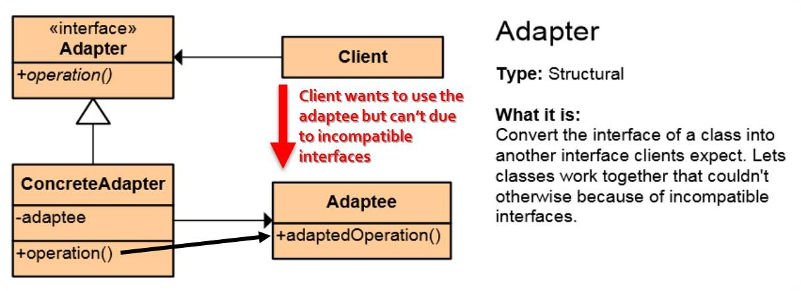
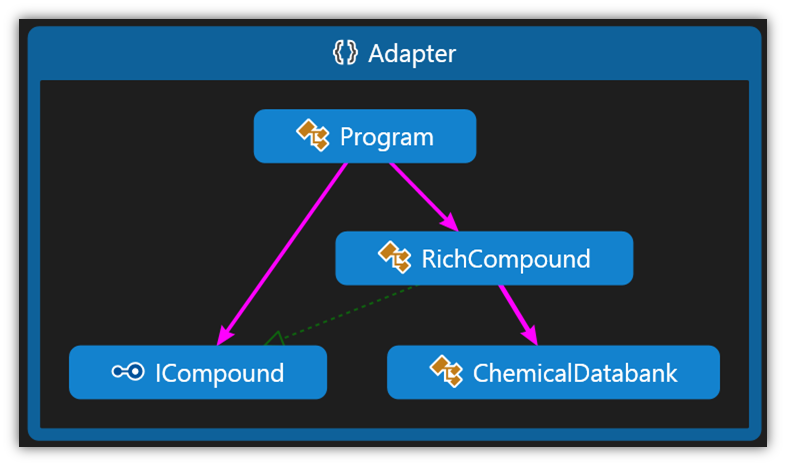

# Adapter Pattern

## Мотивация
В случай на невъзможност два класа да работят заедно, поради несъвместимост между техните интерфейси.

 
## Цел
* Конвертира интерфейс на даден клас в друг интерфейс, който клиентът изисква да има.
 * Обгражда(wrap) съществуващ клас с нов интерфейс. Шаблонът е наричан още **Wrapper pattern**
 * Пълно вписване на стар компонент към нова система 
* Позволява на два класа да работят заедно, в случай, че иначе това е невъзможно поради несъвместимост между интерфейсите им.
* Adapter - специален клас, който имплементира наш интерфейс и използва външен клас.

## Приложение

Желаем клиентът да работи със строго фиксиран интерфейс(Adapter). В някакъв момент искаме да работим с външна библиотека Adaptee, но това е невъзможно поради несъвместимост между интерфейсите, а ако тази библиотека няма интерефейси е възможно в резултат да се получи много сериозен coupling с класовете на тази библиотека.
Решението е да създадем ConcreteAdapter- това е класът ни, който ще използваме като адаптер. Той ще имплементира интерфейса Adapter и ще създаде инстанция на Adaptee, и чрез този клас, операциите ни ще се пренасочат към Adaptee.

 
## Известни употреби
В **ADO.NET** имаме интерфейс **IDataAdapter**, който използва класовете OleDbDataAdapter, SqlClientDataAdapter, които използват различни видове бази данни и съответно различни заявки. По този начин, правейки заявките си през IDataAdapter нас не ни вълнува кой точно конкретен клас-адаптер ще бъде използван в последствие.

## Имплементация

Имаме клас **ChemicalDatabank**, който е legacy клас и не можем да го преработваме, но информацията от него би ни била полезна. В случая ако ни трябва цялата информация за водата, за да я "извлечем" ще трябва да викаме няколко метода и т.н.

	internal class ChemicalDatabank
    {
        // The databank 'legacy API'
        public float GetCriticalPoint(string compound, string point)
        {
            if (point == "M")
            {
                // Melting Point
                switch (compound.ToLower())
                {
                    case "water":
                        return 0.0f;
                    case "benzene":
                        return 5.5f;
                    case "ethanol":
                        return -114.1f;
                    default:
                        return 0f;
                }
            }
            else
            {
                // Boiling Point
                switch (compound.ToLower())
                {
                    case "water":
                        return 100.0f;
                    case "benzene":
                        return 80.1f;
                    case "ethanol":
                        return 78.3f;
                    default:
                        return 0f;
                }
            }
        }

        public string GetMolecularStructure(string compound)
        {
            switch (compound.ToLower())
            {
                case "water":
                    return "H20";
                case "benzene":
                    return "C6H6";
                case "ethanol":
                    return "C2H5OH";
                default:
                    return string.Empty;
            }
        }

        public double GetMolecularWeight(string compound)
        {
            switch (compound.ToLower())
            {
                case "water":
                    return 18.015;
                case "benzene":
                    return 78.1134;
                case "ethanol":
                    return 46.0688;
                default:
                    return 0d;
            }
        }
    }

Желаем да имплементираме Adapter интерфейс, който да ни позволява да показваме цялата желана от нас информация.

	namespace Adapter
	{	    
	    internal interface ICompound
	    {
	        void Display();
	    }
	}

Създаваме класа **RichCompound**, който имплементира интерфейса:

	internal class RichCompound : ICompound
    {
        private readonly string chemical;
        private readonly float boilingPoint;
        private readonly float meltingPoint;
        private readonly double molecularWeight;
        private readonly string molecularFormula;

        public RichCompound(string chemical)
        {
            this.chemical = chemical;

            ChemicalDatabank dataBank = new ChemicalDatabank();

            this.boilingPoint = dataBank.GetCriticalPoint(this.chemical, "B");
            this.meltingPoint = dataBank.GetCriticalPoint(this.chemical, "M");
            this.molecularWeight = dataBank.GetMolecularWeight(this.chemical);
            this.molecularFormula = dataBank.GetMolecularStructure(this.chemical);
        }

        public void Display()
        {
            Console.WriteLine("Compound: {0} ------ ", this.chemical);
            Console.WriteLine(" Formula: {0}", this.molecularFormula);
            Console.WriteLine(" Weight : {0}", this.molecularWeight);
            Console.WriteLine(" Melting Point: {0}", this.meltingPoint);
            Console.WriteLine(" Boiling Point: {0}", this.boilingPoint);
            Console.WriteLine();
        }
    }

В конструктора RichCompound създаваме инстанция на ChemicalDatabank класа. Сетваме стойностите на съответните полета със стойности, които взимаме чрез съответните методи, на инстанцията dataBank на класа ChemicalDatabank.
След което принтираме данните чрез метод DIsplay().

Клиентската част е следната:

	static void Main()
    {
        ICompound water = new RichCompound("water");
        water.Display();

        ICompound benzene = new RichCompound("benzene");
        benzene.Display();

        ICompound ethanol = new RichCompound("ethanol");
        ethanol.Display();

        ICompound etilen = new RichCompound("etilen");
        etilen.Display(); // will display default values of the variables, because there isn't etilen item in the databank
    }

## UML клас-диаграма

## Последствия
* Използваме **Has-A** релация, която е за предпочитане пред **Is-A** релацията.

## Сродни шаблони

**Adapter** е сроден на **Decorator** шаблон, но за разлика от Decorator, който имплементира същият интерфейс, който имплементират Component класовете, при **Adapter** шаблона, Adapter класа wrapp-ва изцяло друг, съвсем отделен клас, който с нищо не е свързан с Adapter класа.

