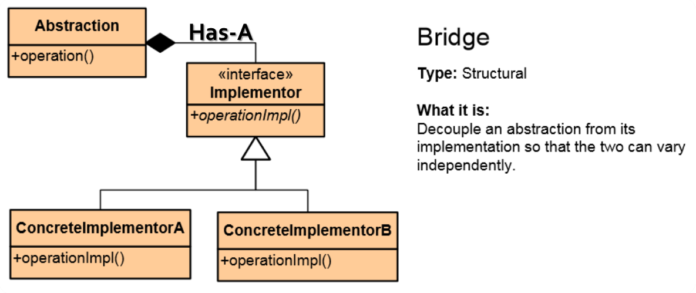
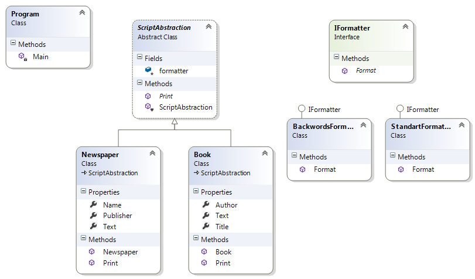

# Bridge Pattern

## Мотивация

Необходимостта да разделим абстракцията от имплементацията, които по подразбиране са сдвоени(coupled);

## Цел

* Разделение на абстракцията от имплементацията.
* По този начин, те могат да съществуват независими.
* Една абстракция ползва друга абстракция, и те могат да се променят по наше желание.

## Приложение
Горните цели постигаме като реално вдигаме абстракцията с още едно ниво.

В случая въвеждаме нов интерфейс Implementor, който премоства връзката между конкретните имплементатори ConcreteImplementatorA и ConcreteImplementatorB. Този интерфейс се нарича **Bridge**, затова и шаблонът носи това име. Той се явява базов за ConcreteImplementatorA и ConcreteImplementatorB и осъщестява връзката с Abstraction класа(интерфейса).

Връзката между Abstraction и Implementor е **Has-A**, която за ралика от **Is-A**(нещо е(нагледник на) друго нещо), е релация указваща, че **нещо има инстанция на/референция към друго нещо**. Т.е. Abstraction в случая има инстанция на Implementor.

Клиентът ще работи с абстрактният клас/интерфейс Abstraction.

## Известни употреби

## Имплементация

// Имаме абстрактен клас Abstraction( в случая ScriptAbstraction), който има релация с интерфейс Implementor(в случая IFormatter)

    internal abstract class ScriptAbstraction
    {
        protected readonly IFormatter formatter;

        internal ScriptAbstraction(IFormatter formatter) // Keeping Dependency Inversion principle
        {
            this.formatter = formatter;
        }

        public abstract void Print();
    }

// Имаме наследници на абстрактният клас. Клас Book

	internal class Book : ScriptAbstraction
    {
        public Book(IFormatter formatter)
            : base(formatter)
        {
        }

        public string Title { get; set; }

        public string Author { get; set; }

        public string Text { get; set; }

        public override void Print()
        {
            Console.WriteLine("-------------------");
            Console.WriteLine(this.formatter.Format("Title", this.Title));
            Console.WriteLine(this.formatter.Format("Author", this.Author));
            Console.WriteLine(this.formatter.Format("Text", this.Text));
            Console.WriteLine("-------------------");
        }
    }

и клас Newspaper

	internal class Newspaper : ScriptAbstraction
    {
        public Newspaper(IFormatter formatter)
            : base(formatter)
        {
        }

        public string Name { get; set; }

        public string Publisher { get; set; }

        public string Text { get; set; }

        public override void Print()
        {
            Console.WriteLine("-------------------");
            Console.WriteLine(this.formatter.Format("Name", this.Name));
            Console.WriteLine(this.formatter.Format("Publisher", this.Publisher));
            Console.WriteLine(this.formatter.Format("Text ", this.Text));
            Console.WriteLine("-------------------");
        }
    }

// Премостването го имплементираме с интерфейса IFormatter(Implementor по смисъла на принципната клас диаграма), в случая това е нашият **Bridge**

	namespace Bridge.Formatters
	{
	    internal interface IFormatter
	    {
	        string Format(string key, string value);
	    }
	}

// Той има конкретни имплементации(ConcreteImplementor)

	internal class StandartFormatter :IFormatter
    {
        public string Format(string key, string value)
        {
            return string.Format("{0}: {1}", key, value);
        }
    }

и

	internal class BackwordsFormatter : IFormatter
    {
        public string Format(string key, string value)
        {
            string backwordsValue = new string(value.Reverse().ToArray());
            return string.Format("{0}: {1}", key, backwordsValue);
        }
    }

// Клиентска част

	static void Main()
    {
        List<ScriptAbstraction> documents = new List<ScriptAbstraction>();

        StandartFormatter formatter = new StandartFormatter();
        BackwordsFormatter backwordsFormatter = new BackwordsFormatter();

        Book book = new Book(formatter);
        book.Author = "Ernest Hemingway";
        book.Title = "For Whom the Bell Tolls";
        book.Text = "He lay flat on the brown... his folded arms, and...";

        book.Print();

        Newspaper newspaper = new Newspaper(backwordsFormatter)
        {
            Name = "The Guardian",
            Publisher = "Guardian News and Media Limited",
            Text = "European governments ... countries of the EU",
        };

        newspaper.Print();
    }

// Резултат

	-------------------
	Title: For Whom the Bell Tolls
	Author: Ernest Hemingway
	Text: He lay flat on the brown, pine-needled floor of the forest, his chin on his folded arms, and
	 high overhead the wind blew in the tops of the pine trees. The mountainside sloped gently where he lay;
	 but below it was steep and he could see the dark of the oiled road winding through the pass.
	 There was a stream alongside the road and far down the pass he saw a mill beside the stream and the falling
	 water of the dam, white in the summer sunlight.
	-------------------
	-------------------
	Name: naidrauG ehT
	Publisher: detimiL aideM dna sweN naidrauG
	Text : UE eht fo seirtnuoc eht fo tsom neewteb seegufer 000,021 erahs ot laed a etov ytirojam yb hguorht dehsup evah stnemnrevog naeporuE
	-------------------

## UML клас-диаграма

## Последствия
* Решаваме проблеми, които обикновено се пораждат в резултат на наследяването.
* Моделът на имплементиране се променя от **Abstraction -> Implementation** в **Abstraction -> Abstraction -> Implementation**
* Каквато и да е промяна в Abstraction не се отразява на ConcreteImplementatorA и ConcreteImplementatorB **и обратното**.
* Използваме **Has-A** релация, която е за предпочитане пред **Is-A** релацията - **"Favor composition over inheritance".**

## Проблеми
* Кодът се усложнява. Това като цяло важи за шаблоните, но в случая понякога кодът става доста труден за разбиране.

## Сродни шаблони
* Strategy pattern

