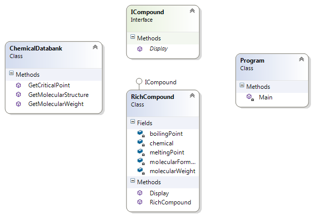

# Adapter Pattern

## Мотивация
В случай на невъзможност два класа да работят заедно, поради несъвместимост между техните интерфейси.

 
## Цел
* Конвертира интерфейс на даден клас в друг интерфейс, който клиентът изисква да има.
 * Обгражда(wrap) съществуващ клас с нов интерфейс. Шаблонът е наричан още **Wrapper pattern**
 * Пълно вписване на стар компонент към нова състема 
* Позволява на два класа да работят заедно, в случай, че иначе това е невъзможно поради несъвместимост между интерфейсите им.
* Adapter - специален клас, който имплементира наш интерфейс и използва външен клас.

## Приложение

Желаем клиентът да работи със строго фиксиран интерфейс(Adapter). В някакъв момент искаме да работим с външна библиотека Adaptee, но това е невъзможно поради несъвместимост между интерфейсите, а ако тази библиотека няма интерефейси е възможно в резултат да се получи много сериозен coupling с класовете на тази библиотека.
Решението е да създадем ConcreteAdapter- това е класът ни, който ще използваме като адаптер. Той ще имплементира интерфейса Adapter и ще създаде инстанция на Adaptee, и чрез този клас, операциите ни ще се пренасочат към Adaptee.

 

## Известни употреби
В **ADO.NET** имаме интерфейс **IDataAdapter**, който използва класовете OleDbDataAdapter, SqlClientDataAdapter, които използват различни видове бази данни и съответно различни заявки. По този начин, правейки заявките си през IDataAdapter нас не ни вълнува кой точно конкретен клас-адаптер ще бъде изпозлван в последствие.

## Имплементация

Имаме клас **ChemicalDatabank**, който е legacy клас и не можем да го преработваме. В даден момент искаме да използваме нова библиотека(клас) **RichCompound**. В случая искаме да изписваме в конзолата информация, което можем да вземем от **ChemicalDatabank**, но тази библиотека не притежава такава функционалност. Използваме интерфейса **ICompound**

	namespace Adapter
	{	    
	    internal interface ICompound
	    {
	        void Display();
	    }
	}

чрез който имплементираме в класа **RichCompound** неговият метод Display():

	namespace Adapter
	{
	    using System;
	
	    internal class RichCompound : ICompound
	    {
	        private readonly string chemical;
	
	        private readonly float boilingPoint;
	        private readonly float meltingPoint;
	        private readonly double molecularWeight;
	        private readonly string molecularFormula;
	
	        public RichCompound(string chemical)
	        {
	            this.chemical = chemical;
	            var bank = new ChemicalDatabank();
	
	            this.boilingPoint = bank.GetCriticalPoint(this.chemical, "B");
	            this.meltingPoint = bank.GetCriticalPoint(chemical, "M");
	            this.molecularWeight = bank.GetMolecularWeight(chemical);
	            this.molecularFormula = bank.GetMolecularStructure(chemical);
	        }
	
	        public void Display()
	        {
	            Console.WriteLine("Compound: {0} ------ ", this.chemical);
	            Console.WriteLine(" Formula: {0}", this.molecularFormula);
	            Console.WriteLine(" Weight : {0}", this.molecularWeight);
	            Console.WriteLine(" Melting Pt: {0}", this.meltingPoint);
	            Console.WriteLine(" Boiling Pt: {0}", this.boilingPoint);
	            Console.WriteLine();
	        }
	    }
	}

Чрез конструктора RichCompound създаваме инстанция на класа, която в съответните си полета пази данните, които взимаме чрез съответните методи, на инстанцията bank на класа ChemicalDatabank.
След което принтираме данните от съответните полета на инстанцията на нашият адаптер-клас

Клиентската част е следната:

	namespace Adapter
	{
	    /// 

	    /// The client code
	    /// 

	    public static class Program
	    {
	        public static void Main()
	        {
	            ICompound water = new RichCompound("Water");
	            water.Display();
	
	            ICompound benzene = new RichCompound("Benzene");
	            benzene.Display();
	
	            ICompound ethanol = new RichCompound("Ethanol");
	            ethanol.Display();
	        }
	    }
	}

