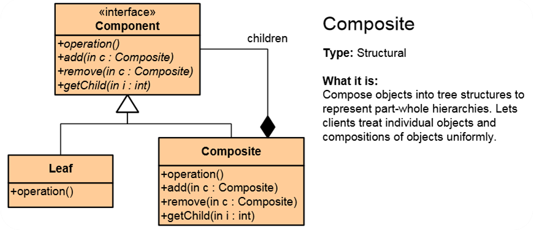
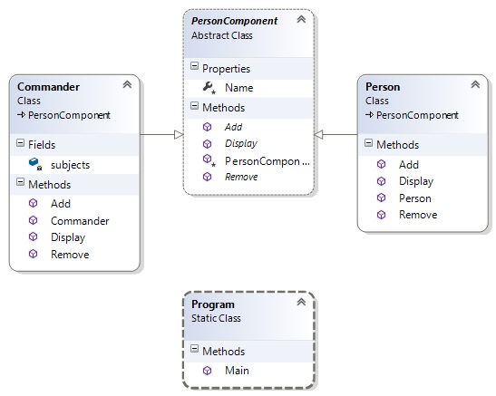

# Composite Pattern

## Мотивация
Необходимостта от комбиниране на различни типове обекти в дървовидна структура(йерархия).
 
## Цел

**Composite pattern** ни позволява да:

* Правим дървовидна струкура от класове, които представляват различни типове обекти.
* Да третираме както простите, така и композитните типове обекти по един и същ начин.

## Приложение

Имаме интерфейс Component, който декларира всички функционалности, които трябва да притежават обектите. Този интерфейс се наследява както от някакъв прост обект(Leaf) така и от композитен обект, който сам в себе си може да съдържа други обетки, било то прости или отново композитни.
 

## Известни употреби

**Composite pattern** е използван в .NET Framework при:

* Windows.Forms.Control и неговите класове-деривати(наследници).
* System.Web.UI.Control и неговите класове-деривати.
* System.Xml.XmlNode и неговите класове-деривати.

## Имплементация
Пример за Mail Receiver, който работи както с конкретен email така и със списък от получатели, съдържащи в себе си множество имейли:

		abstract class MailReceiver {
	    	public abstract void SendMail();
		}

		class EmailAddress : MailReceiver {
		    public override void SendMail() { /*...*/ }
		}

		class GroupOfEmailAddresses : MailReceiver {
		    private List<MailReceiver> participants;

		    public override void SendMail() {
		        foreach(var p in participants) p.SendMail();
		    }
		}

Клиентската част:

	static void Main() {
    	var rootGroup = new GroupOfEmailAddresses();

    	rootGroup.SendMail();
	}

## UML диаграма

PersonComponent е абстрактният Component class(в случая не използваме интерфейс а абстрактен клас). Той се наследява от Person и от Commander. Commander пази в полето си subjects списък с подчинени Person-s и подчинени Commander-s(със свои подчинени Person-s) - т.е. имаме класическа йерархична структура.