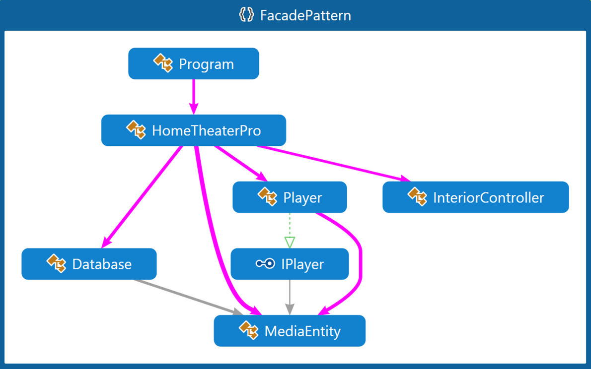

# Fasade Pattern

Терминът **"фасада"** е взаимстван от сферата на архитектурата и строителството. Фасадите на една сграда са външните стени на сградата. Освен конструктивната си роля да носят ерхитектурни елементи като топлинна изолация, прозорци, врати и други, те играят и чисто архитектурна роля, като "представят" сградата пред заобикалящата я среда и скриват вътрешността на сградата. Това, което виждат хората извън сградата, съответно начинът, по който възприемат сградата, се обуслява основно от фасадите на тази сграда. Начинът по който достъпват сграда, чрез врати и прозорци, е функция на фасадата.

## Мотивация
Необходимостта от улесняване на дотъпа на клиента до по-голяма функционалност на кода, например цяла една библиотека.
 
## Цел

**Fasade pattern** е class(или object), който улеснява достъпа на клиента, предоставяйки му опростен интерфейс, до по-голяма и по-сложна функционалност и набор от под-класове. Може да се каже, че **Fasade pattern** скрива голямата част от кода, вътрешността на кода, от клиента. Чрез използване на **Fasade pattern** се постигат следните ефекти:

* Опростява използването на дадена функционалност/библиотека.
* Намалява зависимостите между външният и нашият код, спазвайки принципа **"principle of least knowledge"**(Закон на Demeter), което води до "loose coupling" ефект.
* Скриваме(зад "фасада") лошо написан API, използвайки по-добре написани наши методи/класове.
* Предпазваме се от преизползване на код- това е допълнителен ефект от използването на шаблона

## Известни употреби

* **Fasade pattern** е използван при много Win32 API базирани класове с цел да се скрие сложността на Win32 методите.
* При XmlSerializer (в .NET) и JSON serializer (в JSON.NET) скрива сложна имплементаци, включващата генериране на асемблита "on-the-fly" зад много лесен за използване клас.
* WebClient и File класовете са други примери за използване на този патърн.

## Имплементация
Пример за home theater :

	popper.On();
	popper.Pop();
	amp.On();
	amp.SetSurroundSound();
	amp.SetVolume(10);
	amp.SetDvd(dvd);
	screen.Down();
	lights.Dimm(20);
	projector.On();
	projector.WideScreenMode();
	dvd.On();
	dvd.Play("Star wars");

Цялата тази функционалност можем да я скрием зад клас-фасада:

	homeTheater.WatchMovie("Star wars");

## UML- клас диаграма

Клиентският клас, в случая Program.cs има достъп само до класа HomeTheaterPro, а той от своя страна има достъп до другите класове, като "скрива" тяхната фунцкионалност и имплементация.

