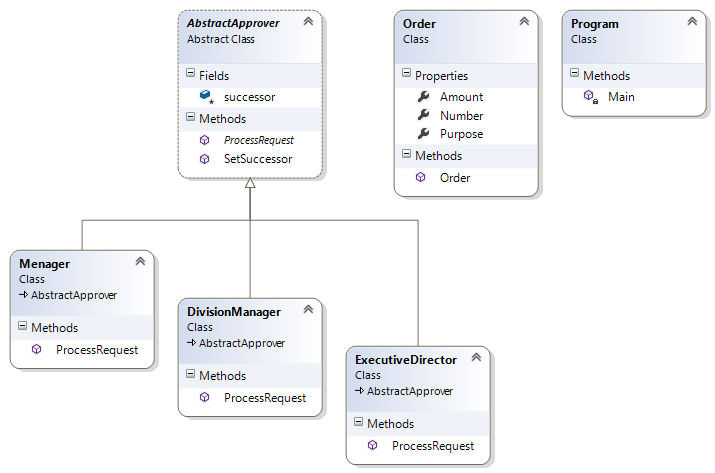

# Chain of Responsibility Pattern

## Мотивация

Необходимостта от имплементиране на последователност от отговорности при изпълнение на някаква заявка.

## Цел

* Осигурява на клиента възможност за препращане на заявката от обект на обект, без клиента да е отговорен за това. Клиента работи само с един първоначален обект на(на схемата Sender) на който подава заявката.
* Препращането на заявките се осъществява по т.н. верига на отговорността(**Chain of Responsibility**)
* Възможно е клиентът да определя веригата на отговорността.

## Приложение

Имаме интерфейс Handler, който пази своя собствена инстанция. Той се имплементира от конкретни прихващачи(ConcreteHandler). Клиента работи чрез интерфейса. Подава заявката, която се обработва по веригата на конкретните прихващачи.

## Известни употреби

* Прихващане на изключенията(**exception handling**) в .NET е една от най-известните употреби на този шаблон

## Имплементация

Ще демонстрираме шаблона с пример за потвърждаване на поръчки с различно количество. Отговорността на обектите е в зависимост от количеството.

// Клас конструиращ поръчки

	public class Order
    {
        public Order(int number, double? amount, string purpose)
        {
            this.Number = number;
            this.Amount = amount;
            this.Purpose = purpose;
        }

        public int Number { get; set; }

        public double? Amount { get; set; }

        public string Purpose { get; set; }
    }

// Абстрактен клас Handler - пази своя собствена инстанция. Тук указваме и кой е ще бъде конкретният последовател(successor) на конкретният имплементатор;

	internal abstract class AbstractApprover
    {
        protected AbstractApprover successor;

        public void SetSuccessor(AbstractApprover successor)
        {
            this.successor = successor;
        }

        public abstract void ProcessRequest(Order order);

    }

// Конкретни наследници на абстрактният клас(ConcreteHandler-s)

* Manager

	    internal class Menager : AbstractApprover
	    {
	        public override void ProcessRequest(Order order)
	        {
	            if (order.Amount < 1000)
	            {
	                Console.WriteLine("{0} approved order #{1}, for amount of {2}, purpose {3}",
	                    this.GetType().Name, order.Number, order.Amount, order.Purpose);
	            }
	            else if (order.Amount != null)
	            {
	                successor.ProcessRequest(order);
	            }
	            else
	            {
	                Console.WriteLine("Your order is invalid");
	            }
	        }
	    }

* DivisionManager

	    internal class DivisionManager : AbstractApprover
	    {
	        public override void ProcessRequest(Order order)
	        {
	            if (order.Amount < 5000)
	            {
	                Console.WriteLine("{0} approved order #{1}, for amount of {2}, purpose {3}",
	                    this.GetType().Name, order.Number, order.Amount, order.Purpose);
	            }
	            else if (order.Amount != null)
	            {
	                successor.ProcessRequest(order);
	            }
	            else
	            {
	                Console.WriteLine("Your order is invalid");
	            }
	        }
	    }

* ExecutiveDirector

		class ExecutiveDirector : AbstractApprover
	    {
	        public override void ProcessRequest(Order order)
	        {
	            if (order.Amount < 10000)
	            {
	                Console.WriteLine("{0} approved order #{1}, for amount of {2}, purpose {3}",
	                    this.GetType().Name, order.Number, order.Amount, order.Purpose);
	            }
	            else if (order.Amount != null)
	            {
	                Console.WriteLine("The amount is exceeding 10 000 units! Please, wait for our special offer!");
	            }
	            else
	            {
	                Console.WriteLine("Your order is invalid");
	            }
	        }
	    }

// Клиентска част

	static void Main()
    {
        AbstractApprover petar = new Menager();
        AbstractApprover dimitar = new DivisionManager();
        AbstractApprover ivan = new ExecutiveDirector();

        //set successors
        petar.SetSuccessor(dimitar);
        dimitar.SetSuccessor(ivan);

        Order smallOrder = new Order(1, 999.99, "Water delivering");
        petar.ProcessRequest(smallOrder);

        Order mediumOrder = new Order(2, 1001, "Fuel delivering");
        petar.ProcessRequest(mediumOrder);

        Order bigOrder = new Order(3, 9999, "Oil delivering");
        petar.ProcessRequest(bigOrder);

        Order specialOrder = new Order(4, 10001, "Tanker delivering");
        petar.ProcessRequest(specialOrder);

        Order nullOrder = new Order(5, null, "Test null order");
        petar.ProcessRequest(nullOrder);
    }

// Резултат

	Menager approved order #1, for amount of 999.99, purpose Water delivering
	DivisionManager approved order #2, for amount of 1001, purpose Fuel delivering
	ExecutiveDirector approved order #3, for amount of 9999, purpose Oil delivering
	The amount is exceeding 10 000 units! Please, wait for our special offer!
	Your order is invalid

## UML клас-диаграма

## Последствия
* Клиентът изпраща само една заявка, а не множество заявки към множество обекти.
* Опростява между-обектовите връзки. Всеки обект пази референция към следващият обект на който може да изпраща заявка.
* Всеки обект пази референция само към следващият обект.
* Обектът обработва заявката или, ако не може да я обработи, я изпраща на следващият обект.
* Клиентът не знае кой е обработил заявката.
* Наличие на **дърво на отговорностите**(tree of responsibilities).

## Сродни модели
* Composite е подобен на този по отношение на създаването на дърво на отговорностите. Разбира се, връзката е не, чрез наследяване, а на ниво пазене на 
инстанция към другият обект.

## Проблеми

