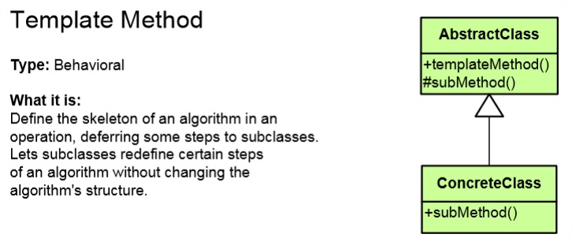
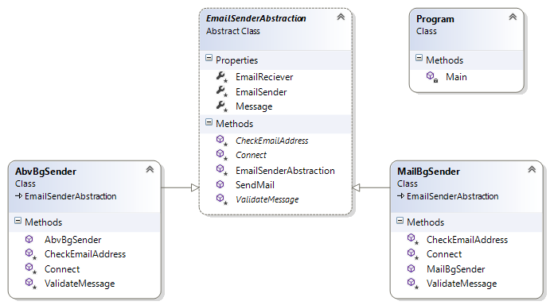

# Template Method Pattern

## Мотивация
Необходимост от дефиниране на структура на даден алгоритъм.

 
## Цел
* Дефинира структура на даден алгоритъм в метод, като се оставя част от имплементацията му на под-класовете.
* **Template Method pattern** позволява на подкласовете да предефинират имплементацията на дадена част/части от алгоритъма, но не им позволява да променят структурата на алгоритъма.
* Разчита на наследяване на класовете

## Приложение
Шаблонът се прилага обикновено, когато искаме да подпъхнем нова част в алгоритъма или да преизползваме неговите стъпки. Също така, когато искаме няколко класа(наследници на абстрактен клас) да използват алгоритъм с една и съща структура, намиращ се в техният родителски клас. Начинът на работа и последователността на стъпките не се променят. Някои от стъпките могат да бъдат напълно имплементирани в базовият клас, с цел да се спази принципа dont-repeat-yourself(DRY)

На клас диаграмата се вижда как подкласът ConcreteClass наследява абстрактният клас AsbtractClass и имплементира абстрактният метод subMethod(). Абстрактният клас може да притежава виртуални или абстрактни методи които, може да са(или да не са) напълно имплементирани и се нарича hook. В последствие класът наследник или го овъррайдва или работи с вече получената имплементация.

## Известни употреби
В .NET може да се овъррайдва Render() метода.

## Имплементация

// Абстрактен клас

	public abstract class EmailSenderAbstraction
    {
        protected EmailSenderAbstraction(string sender, string reciever, string message)
        {
            this.EmailSender = sender;
            this.EmailReciever = reciever;
            this.Message = message;
        }

        protected string EmailSender { get; set; }

        protected string EmailReciever { get; set; }

        protected string Message { get; set; }

        public bool SendMail()
        {
            if (!CheckEmailAddress())
            {
                return false;
            }
            if (ValidateMessage())
            {
                return false;
            }
            if (!Connect())
            {
                return false;
            }

            return true;
        }

        protected abstract bool CheckEmailAddress();

        protected abstract bool ValidateMessage();

        protected abstract bool Connect();
    }

// Класове наследница имплементиращи абстракцията

	public class AbvBgSender : EmailSenderAbstraction
    {
        public AbvBgSender(string sender, string reciever, string message)
            : base(sender, reciever, message)
        {

        }

        protected override bool CheckEmailAddress()
        {
            return this.EmailSender.EndsWith("@abv.bg");
        }

        protected override bool ValidateMessage()
        {
            return this.Message.Contains("spam");
        }

        protected override bool Connect()
        {
            Console.WriteLine("Connecting to abv.bg on port 465 (secure SMTP connection)...");
            Thread.Sleep(1000);
            Console.WriteLine("Check email address...");
            Thread.Sleep(1000);
            Console.WriteLine("Sending email...");

            return true;
        }
    }

и

    class MailBgSender : EmailSenderAbstraction
    {
        public MailBgSender(string sender, string reciever, string message)
            : base(sender, reciever, message)
        {
        }

        protected override bool CheckEmailAddress()
        {
            return this.EmailSender.EndsWith("@mail.bg");
        }

        protected override bool ValidateMessage()
        {
            return this.Message.Contains("spam");
        }

        protected override bool Connect()
        {
            Console.WriteLine("Connecting to abv.bg on port 465 (secure SMTP connection)...");
            Thread.Sleep(1000);
            Console.WriteLine("Check email address...");
            Thread.Sleep(1000);
            Console.WriteLine("Sending email...");

            return true;
        }
    }

// Клиентска част

	static void Main()
    {
        EmailSenderAbstraction abvBg = new AbvBgSender("ivan@abv.bg", "petkan@gmail.com", "Very important message!");
        bool abvBgSenderResult = abvBg.SendMail();
        Console.WriteLine("Result: {0}", abvBgSenderResult ? "Email successfully sent!" : "Failed to send email!");

        EmailSenderAbstraction mailBg = new MailBgSender("spammer@mail.bg", "petkan@gmail.com", "This is spam");
        bool mailBgSender = mailBg.SendMail();
        Console.WriteLine("Result: {0}", mailBgSender ? "Email successfully sent!" : "Failed to send email!");
    }

Работим с абстракцията EmailSenderAbstraction, и правим инстанция на различните пращачи на писма. Извикваме методът SendMail(), който последователно вика и изпълнява hook методите CheckEmailAddress(), ValidateMessage() и Connect();

## UML клас-диаграма

## Последствия
* Спазва се SOLID принципа OCP.
* Спазва се принципа dont-repeat-yourself(DRY)

## Сродни модели

**Template Мethod pattern** е близък до **Builder pattern**, с тази разлика, че **Builder pattern** в качеството си на creational pattern се грижи да създава инстанции на обекти, а **Template Мethod** само пази структурата на алгоритъма.

