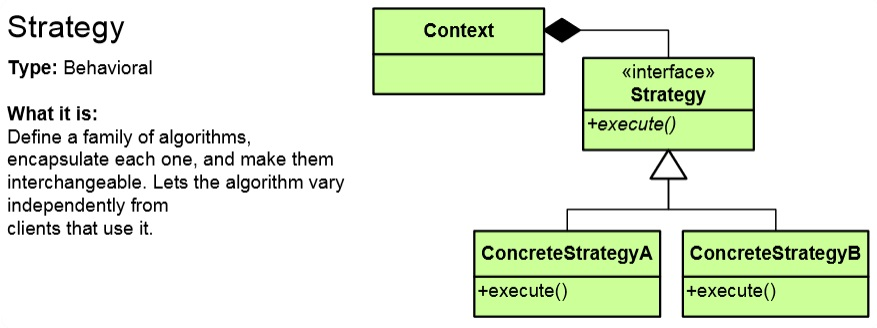
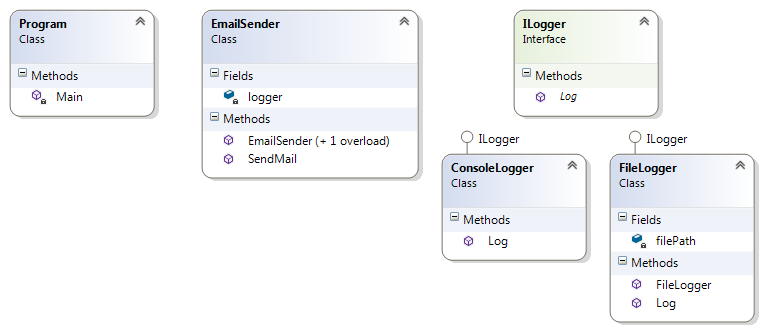

# Strategy Pattern

## Мотивация
Необходимостта от създаване на абстракция на алгоритъм.
 
## Цел
* Чрез интерфейс определяме входните данни и изходните данни на опреден алгоритъм.
* Всички класове, които имплементират този интерфейс определят как точно ще изглежда този алгоритъм

## Приложение
Известен code-smell при който е уместна употребата на **Strategy Pattern** е употребата на switch или if конструкции.

Имаме клиент(Context) който работи с интерфейса Strategy, който има две конкретни имплементации - ConcreteStrategyA и ConcreteStrategyB
 

## Известни употреби
* В .NET се използва при Func or Delegates
* При **property injection** реализацията на Dependency inversion принципа.
* 

## Имплементация

// Интерфейс Strategy

    public interface ILogger
    {
        void Log(string message);
    }	

// Конкретни имплементации- ConcreteStrategy-s

    public class ConsoleLogger : ILogger
    {        
        public void Log(string message)
        {
            Console.WriteLine("[{0}] : {1}", DateTime.Now, message);
        }
    }

и

    public class FileLogger : ILogger
    {
        private readonly string filePath;

        

        public FileLogger(string filepath)
        {
            this.filePath = filepath;
        }

        public void Log(string message)
        {
            File.AppendAllLines(filePath, new List<string> { string.Format("[{0}] : {1}", DateTime.Now, message) });
        }
    }

// Клас Context който е в релация с интерфейса

    public class EmailSender
    {
        private readonly ILogger logger;

        // Poor man's Dependency inversion
        public EmailSender()
            : this(new ConsoleLogger())
        {
        }

        public EmailSender(ILogger log) // Contstructor injection(DIP)
        {
            this.logger = log;
        }

        public void SendMail()
        {
            this.logger.Log("Connecting to the server...");
            this.logger.Log("Validating email address...");
            this.logger.Log("Sending mail...");
            this.logger.Log("Email sent!");
        }
    }

// Клиентска част

    static void Main()
    {
        ILogger fileLogger = new FileLogger("log.txt");

        EmailSender senderWithFileLogger = new EmailSender(fileLogger);
        senderWithFileLogger.SendMail(); // logs in the file

        EmailSender senderWithConsoleLogger = new EmailSender(); // the default contructor will construct parameter ConsoleLogger
        senderWithConsoleLogger.SendMail();
    }

// Резултатът от log.txt и от конзолата е един и същ

	[23.9.2015 г. 17:22:07 ч.] : Connecting to the server...
	[23.9.2015 г. 17:22:07 ч.] : Validating email address...
	[23.9.2015 г. 17:22:07 ч.] : Sending mail...
	[23.9.2015 г. 17:22:07 ч.] : Email sent!

## UML клас-диаграма

## Последствия
* Логиката ни започва да живее в отделни класове- спазваме separation of concerns(SoC) принципа.
* Кодът става лесен за тестване, като можем да използваме и mocking
* Можем да добавяме нови strategies.
* **Strategy Pattern** спазва SOLID принципа **Depenency-inversion**. Дадени класове зависят от дадена абстракция и това определя какви данни подаваме и съответно получаваме. Изнасянето на тези зависимости като конкретни параметри е спазване на depenency-inversion принципа.
* **Strategy Pattern** имплементира Open-Closed принципа(един от SOLID принципите).

## Сродни модели

Прилича на **Template Method**, по това, че задава абстракция за имплементиране на някаква логика, но за разлика от **Template Method**, който указва конкретните стъпки, **Strategy** задава само входните и изходните данни.

## Проблеми

