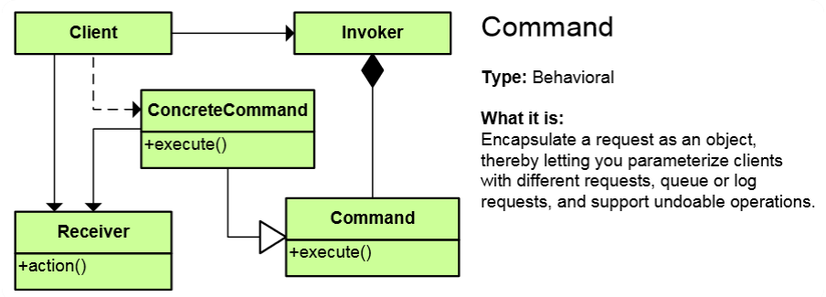
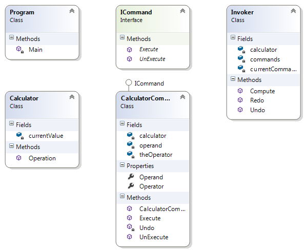

# Command Pattern

## Мотивация

Необходимостта да разкачим клиента, който изпълнява командите от детайлите и зависимостите на командната логика

## Цел

* Представя някакво действие(заявка) като обект.
* Разкачваме клиента и командите от командната логика.

## Приложение

Всичко, което трябва да се изпълни се намира в интерфейса Command. Най-често методите в Command са void методи без параметри, или най-много параметрите да са някаква абстракция.
Invoker е клас, който пази списък с команди, съответно е в релация с Command.
ConcreteCommand имплементира Command и в конструктора му подаваме параметри с Dependency inversion, т.е. правим constructor injection.
Receiver е клас, който също може да работи с командите. 

## Известни употреби
* Командите в WPF/Silverlight

## Имплементация

// Абстракция Command

    public interface ICommand
    {
        void Execute();

        void UnExecute();
    }

// Клас ConcreteCommand имплементатор на Command

    public class CalculatorCommand : ICommand
    {
        private readonly Calculator calculator;
        private char theOperator;
        private int operand;

        public CalculatorCommand(Calculator calculator, char theOperator, int operand)
        {
            this.calculator = calculator;
            this.Operator = theOperator;
            this.Operand = operand;
        }

        public char Operator
        {
            get { return this.theOperator; }
            private set { this.theOperator = value; }
        }

        public int Operand
        {
            get { return this.operand;  }
            private set { this.operand = value; }
        }

        public void Execute()
        {
            this.calculator.Operation(this.Operator, this.Operand);
        }

        public void UnExecute()
        {
            char undoneOperator = Undo(this.Operator);
            this.calculator.Operation(undoneOperator, this.Operand);
        }

        private static char Undo(char operatorToUndo)
        {
            switch (operatorToUndo)
            {
                case '+': return '-';
                case '-': return '+';
                case '*': return '/';
                case '/': return '*';
                default: throw new ArgumentException("@operator");
            }
        }
    }

// Клас Reciever

    public class Calculator
    {
        private decimal currentValue;

        public void Operation(char theOperator, int operand)
        {
            switch (theOperator)
            {
                case '+':
                    this.currentValue += operand;
                    break;
                case '-':
                    this.currentValue -= operand;
                    break;
                case '*':
                    this.currentValue *= operand;
                    break;
                case '/':
                    this.currentValue /= operand;
                    break;
                default:
                    throw new ArgumentOutOfRangeException("Illegal operator");
            }

            Console.WriteLine("Current value = {0,3} (following {1} {2})", this.currentValue, theOperator, operand);
        }
    }

// Клас Invoker

    public class Invoker
    {
        private readonly Calculator calculator = new Calculator();
        private readonly List<ICommand> commands = new List<ICommand>();
        private int currentCommandIndex;

        public void Redo(int levels)
        {
            Console.WriteLine("\n---- Redo {0} levels ", levels);
            for (int i = 0; i < levels; i++)
            {
                if (this.currentCommandIndex < this.commands.Count - 1)
                {
                    var command = this.commands[this.currentCommandIndex++];
                    command.Execute();
                }
            }
        }

        public void Undo(int levels)
        {
            Console.WriteLine("\n---- Undo {0} levels ", levels);
            for (int i = 0; i < levels; i++)
            {
                if (this.currentCommandIndex > 0)
                {
                    var command = this.commands[--this.currentCommandIndex];
                    command.UnExecute();
                }
            }
        }

        public void Compute(char theOperator, int operand)
        {
            ICommand command = new CalculatorCommand(this.calculator, theOperator, operand);
            command.Execute();

            this.commands.Add(command);
            this.currentCommandIndex++;
        }
    }

// Клиентска част

	static void Main()
	{
	    var calculator = new Calculator();
	    CalculatorCommand command = new CalculatorCommand(calculator, '+', 5);
	
	    command.Execute(); // Current value =   5 (following + 5)
	    command.Execute(); // Current value =  10 (following + 5)
	    command.UnExecute(); // Current value =   5 (following - 5)
	
	    // using Invoker
	    Invoker user = new Invoker();
	                
	    user.Compute('+', 7);  // Current value =   7 (following + 7)
	    user.Compute('-', 3);  // Current value =   4 (following - 3)
	    user.Compute('*', 12); // Current value =  48 (following * 12)
	
	    user.Undo(2);           // ---- Undo 2 levels
	                            //Current value =   4 (following / 12)
	                            //Current value =   7 (following + 3)
	
	    user.Redo(1);           //---- Redo 1 levels
	                            // Current value =   4 (following - 3)
	
	}

## UML клас-диаграма

## Последствия
Можем да изпозлваме **Command** шаблона в комбинация с:

* **Factory Pattern** - Factory може да бъде използвано да конструира команди
* **Null Object** - връщането на **"null command"** може да бъде по-приложимо отколкото връщането на **null.**
* Composite - можем да конструираме команди с комадни наследници и някакъв метод Execute() ще вика Execute() на всички наследници

## Сродни модели

Прилича на **Strategy**, по това, че задава абстракция за имплементиране на някаква логика, но за разлика от **Strategy**, който задава входните и изходните данни на методите, които се имплементират, и по това кара имплементаторите му да си приличат, Command шаблона задава void методи без параметри, като по този начин интерфейса може да се имплементира от всякакви обекти без те да си приличат, освен по това, че имат имплементиран сходен метод. 

## Проблеми

