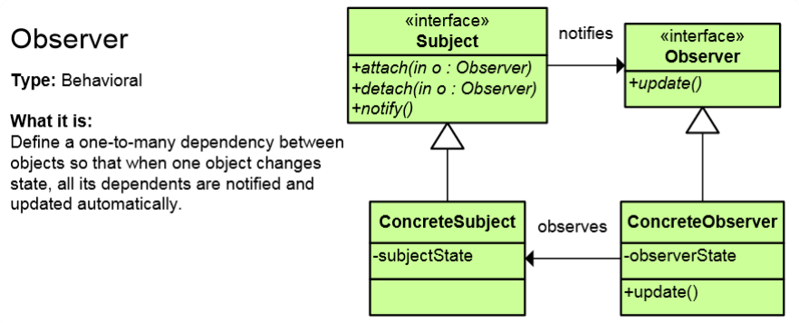
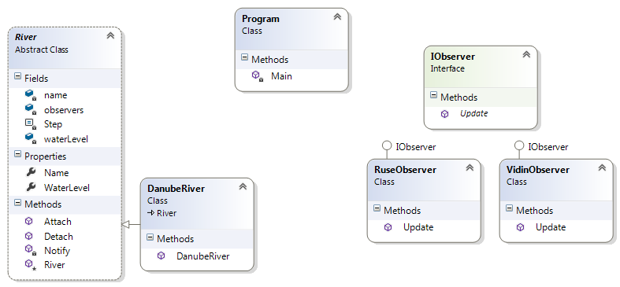

# Observer Pattern

## Мотивация

Необходимостта да се дефинира връзка от тип **"one-to-many"**

## Цел

* Дефинира връзка между един и множество от други обекти.
* Когато обекта промени своето състояние, всички свързани с него обекти(observers) биват известени и актуализират състоянието си.
* Разделя предмета от наблюдателя.
* Дава ни отделни интерфейси за delegates-прехващачи на събития и нещо, което предизиква събития- events
* 
## Приложение
* Когато един обект зависи от друг обект
* Когато промяната в състоянието на един обект изисква промяна в състоянията на други обекти.
* Когато промяната в един обект води до промяна в други обекти, но искаме да разкачим този обект, така, че той да не знае за другите обекти.

Интерфейсът Subject е в релация с интерфейсът Observer, като има метод attach(), detach()(закачаме и разкачаме наблюдател) и notify()(за да извести наблюдателите. От там нататък може да имаме множество конкретни имплементации на интерфейса Observer, но това не касае интерфейса Subject. Subject същи има различни имплементации, които да предизвикват събития. Както при **Bridge** имаме двойно разкачване, чрез две абстракции.

## Известни употреби
* Изключително много се използва там, където работим с потребителски интерфейс.
* В C# event-модела и event handling представлява имплементация на **Observer** шаблона.
* Angular.js, WPF, Silverlight

## Имплементация

// Интерфейс Observer

    public interface IObserver
    {
        void Update(River river);
    }

// ConcreteObserver класове

    public class RuseObserver : IObserver
    {
        public void Update(River river)
        {
            Console.WriteLine("Notification from Ruse Observer Station of {0} river. Water level change to {1} centimetres",
                river.Name, river.WaterLevel);
        }
    }

и

    class VidinObserver : IObserver
    {
        public void Update(River river)
        {
            Console.WriteLine("Notification from Vidin Observer Station of {0} river. Water level change to {1} centimetres",
                river.Name, river.WaterLevel);
        }
    }

// Абстрактен клас Subject

	public abstract class River
    {
        private const int Step = 2;
        private readonly List<IObserver> observers = new List<IObserver>();
        private readonly string name;
        private int waterLevel;

        protected River(string name, int initialWaterLevel)
        {
            this.name = name;
            this.waterLevel = initialWaterLevel;
        }

        public int WaterLevel
        {
            get { return this.waterLevel; }
            set
            {
                if (Math.Abs(this.waterLevel - value) > Step)
                {
                    this.waterLevel = value;
                    this.Notify();
                }
            }
        }

        public string Name { get { return this.name;  } }

        public void Attach(IObserver observer)
        {
            this.observers.Add(observer);
        }

        public void Detach(IObserver observer)
        {
            this.observers.Remove(observer);
        }

        private void Notify()
        {
            foreach (IObserver observer in this.observers)
            {
                observer.Update(this);
            }
        }
    }

// ConcreteSubject

    public class DanubeRiver : River
    {
        public DanubeRiver()
            : base("Danube", 573)
        {
        }
    }

// Клиентска част

    static void Main()
    {
        IObserver observerRuser = new RuseObserver();
        IObserver observerVidin = new VidinObserver();

        River danube = new DanubeRiver("Danube", 573);

        Console.WriteLine("{0} river initial water level: {1}", danube.Name, danube.WaterLevel);

        danube.Attach(observerRuser);
        danube.Attach(observerVidin);
        
        danube.WaterLevel = 573;

        danube.WaterLevel = 614;

        Console.WriteLine("Detaching Vidin Observer Station");
        danube.Detach(observerVidin);

        danube.WaterLevel = 475;
        danube.WaterLevel = 475;
    }

// Резултат

	Danube river initial water level: 573
	Sans changement!
	Notification from Ruse Observer Station of Danube river. Water level change to 614 centimetres
	Notification from Vidin Observer Station of Danube river. Water level change to 614 centimetres
	Detaching Vidin Observer Station
	Notification from Ruse Observer Station of Danube river. Water level change to 475 centimetres
	Sans changement!

## UML клас-диаграма

## Последствия

## Сродни модели

## Проблеми

