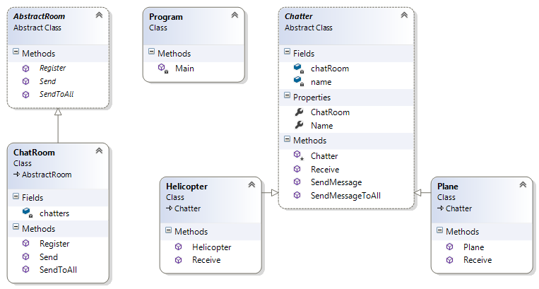

# Mediator Pattern

## Мотивация

Необходимостта да се опрости комуникацията между обектите чрез въвеждане на медиатор.

## Цел
* Дефинира обект, който задава начина на комуникация(през него) на множество от други обекти.
* Логиката за начина на комуникация се изнася в медиатора, вместо всеки обект да пази такава.
* Обектите комуникират посредством медиатор без да знаят един за друг.

## Приложение
**Mediator pattern** силно наподобява реалният пример с кулата за контрол на въздушният трафик, която комуникира с всички самолети и препредава техните съобщения, без те да комуникират помежду си.

Имаме абстракция Mediator с конкретна негова имплементация ConcreteMeadiator. Т.е. имаме зададени правила за комуникиране. Имаме интерфейс Colleague, който се имплементира в множество конкретни ConcreteColleague. Никой от ConcreteColleague не знае за друг такъв.
Medaitor е в релация с Colleague и пази списък с такива обекти.
ConcreteColleague е в релация с ConcreteMediator и пази информация за него. Когато ConcreteColleague иска да съобщи нещо на другите ConcreteColleague реално се свърза с ConcreteMediator
Съществува и имплементация без повишаване на абстракцията.

## Известни употреби
* SignalR

## Имплементация

Пример за имплементация на кула за въздушен контрол служеща за медиатор при комуникацията между въздухоплавателните средства.

// Абстрактен клас Mediator

    public abstract class AbstractRoom
    {
        public abstract void Register(Chatter chatter);

        public abstract void Send(string from, string to, string message);

        public abstract void SendToAll(string from, string message);
    }

// Конкретен медиатор ConcreteMediator

    public class ChatRoom : AbstractRoom
    {
        private readonly Dictionary<string, Chatter> chatters = new Dictionary<string, Chatter>();

        public override void Register(Chatter chatter)
        {
            if (!this.chatters.ContainsValue(chatter))
            {
                this.chatters[chatter.Name] = chatter;
            }

            chatter.ChatRoom = this;
        }

        public override void Send(string from, string to, string message)
        {
            Chatter reciever = this.chatters[to];

            if (reciever != null)
            {
                reciever.Receive(from, message);
            }
        }

        public override void SendToAll(string from, string message)
        {
            foreach (var item in this.chatters)
            {
                if (item.Key != from)
                {
                    item.Value.Receive(from, message);
                }
            }
        }
    }

// Абстракция AbstractColeague клас

    public abstract class Chatter
    {
        private readonly string name;
        private AbstractRoom chatRoom;

        protected Chatter(string name)
        {
            this.name = name;
        }

        public string Name
        {
            get { return this.name; }
        }

        public AbstractRoom ChatRoom
        {
            get { return this.chatRoom; }
            set { this.chatRoom = value; }
        }

        public void SendMessage(string to, string message)
        {
            this.ChatRoom.Send(this.Name, to, message);
        }

        public void SendMessageToAll(string message)
        {
            this.ChatRoom.SendToAll(this.Name, message);
        }

        public virtual void Receive(string from, string message)
        {
            Console.WriteLine("{0} send message to {1}: '{2}'", from, this.Name, message);
        }
    }

// Различни имплементации ConcreteColleague

    public class Helicopter : Chatter
    {
        public Helicopter(string name)
            : base(name)
        {
        }

        public override void Receive(string from, string message)
        {
            base.Receive(from, message);
        }
    }

и

    public class Plane : Chatter
    {
        public Plane(string name)
            : base(name)
        {
        }

        public override void Receive(string from, string message)
        {
            base.Receive(from, message);
        }
    }

// Клиентска част

    static void Main()
    {
        Chatter airbus = new Plane("Airbus 320");
        Chatter boeing = new Plane("Boeing 737");
        Chatter tupolev = new Plane("Tu 154");
        Chatter bell = new Helicopter("Bell 429");

        ChatRoom airTrafficControlTower = new ChatRoom();

        airTrafficControlTower.Register(airbus);
        airTrafficControlTower.Register(boeing);
        airTrafficControlTower.Register(tupolev);
        airTrafficControlTower.Register(bell);

        Console.WriteLine("A helicopter communicates with plane ----------------------------------------------");
        bell.SendMessage("Tu 154", "Hello guys, keep your altitude, I am right above you!");
        tupolev.SendMessage("Bell 429", "Get it, go ahead!");

        Console.WriteLine("A plane speeks to everyone ----------------------------------------------------------");
        airbus.SendMessageToAll("I am READY for takeoff");

        Console.WriteLine("The Control tower speeks to the Airbus 320 ------------------------------------------");
        airTrafficControlTower.Send("Control tower", "Airbus 320", "Airbus 320, you have CLEAR for takeoff");

        Console.WriteLine("The Control tower speeks to all aircrafts ------------------------------------------");
        airTrafficControlTower.SendToAll("Control tower", "Everyone keeps the altitude!");
    }

// Резултат

	A helicopter communicates with plane ----------------------------------------------
	Bell 429 send message to Tu 154: 'Hello guys, keep your altitude, I am right above you!'
	Tu 154 send message to Bell 429: 'Get it, go ahead!'
	
	A plane speeks to everyone ----------------------------------------------------------
	Airbus 320 send message to Boeing 737: 'I am READY for takeoff'
	Airbus 320 send message to Tu 154: 'I am READY for takeoff'
	Airbus 320 send message to Bell 429: 'I am READY for takeoff'
	
	The Control tower speeks to the Airbus 320 ------------------------------------------
	Control tower send message to Airbus 320: 'Airbus 320, you have CLEAR for takeoff'
	
	The Control tower speeks to all aircrafts ------------------------------------------
	Control tower send message to Airbus 320: 'Everyone keeps the altitude!'
	Control tower send message to Boeing 737: 'Everyone keeps the altitude!'
	Control tower send message to Tu 154: 'Everyone keeps the altitude!'
	Control tower send message to Bell 429: 'Everyone keeps the altitude!'

## UML клас-диаграма

## Последствия

* Силно изразен **loоse coupling** ефект, понеже не съществува пряка релация между обектите, които комуникират помежду си(чрез медиатора).
* Позволява ни, чрез промяна на медиатора, да променяме и начина по който те комуникират помежду си.
* Понеже логиката за начина на комуникация се изнася в медиатора, вместо всеки обект да пази такава, това води до спазване на **separation of concernes** и **strong cohesion** принципите.
* **One-to-many** релациите са за предпочитане пред **many-to-many** релациите. Алтернативата на този шаблон е всеки обект да комуникира със всеки друг. Ако имаме 100 обекта, това прави 10 000(!) връзки, което е пример за tight coupling и spaghetti code.

## Сродни модели

## Проблеми
* Медиатор обектът може имплементира сложна логика и да стане много тежък и сложен обект, особено в случай че се увеличи боря на различните по тип обекти с които трябва да комуникира.

