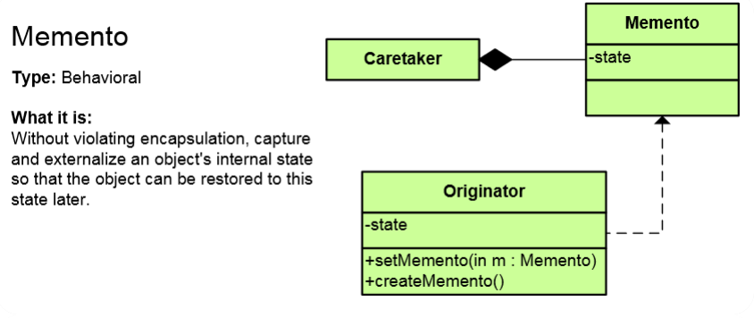

# Memento Pattern

## Мотивация
Необходимостта да запазваме текущото състояние на даден обект/обекти и имплементиране на Undo функционалност.

## Цел
* В Memento обекта пазим цялата информация, която ни е необходима за да възстановим оригиналният обект. Използваме за целта **Prototype pattern**
* Алтернативна имплементация цели не да се пази точно състояние на обекта, а стъпките по създаване на един обект. В този случай, чрез използване на **Command pattern** можем да имплементираме операции и обратните им операции, и пот този начин, чрез използване на обратните операции да "връщаме" обекта в предходно негово състояние. Този вариант използва по-малко памет, но не винаги може да се имплементира. При текстови редактори е приложим, но при графични редактори не е.

## Приложение

**Originator** е оригиналният обект(примерно blank page в текстов редактор), или току-що отворен файл(забележете, обикновено няма функция Undo на файл който току-що сме отворили). Частното поле state пази състоянието на обекта. Методът createMemento() създава Мemento обект в който се пази информация за евентуално бъдещо възстановяване на обекта. Това може да е цялостно състояние на обекта(например при редактиране на картинка), а може да е списък от стъпки, които са направени(при повечето текстови редактори, при калкулаторите и др.)

**Memento** обектът най-често се запазва в отделен файл и това е обектът **Caretaker**. Този обект пази списък с Memento състояния. Понеже този файл е възможно да стане доста голям, софтуерните продукти имат настройки, чрез които да се ограничи неговата големина. Такава настройка, например, е брой стъпки, които могат да се върнат назад, чрез команда Undo. За Photsohop, този брой стъпки по подразбиране е 20, което ще рече, че в Caretaker пазим 20 броя Memento обекта.

Чрез методът **setМemento()** се възстановява оригиналното/предишното състояние на обекта, като го подаваме като параметър на метода.

## Известни употреби
* Сериализацията, прототипизирането, клонирантето, memberwise clone , deep copy са начини да създадем memento.
* В множество програми, Undo функцията е имплементирана чрез някой вариант на Memento pattern.

## Имплементация

// Мemento обект

    public class Memento
    {
        public Memento(string name, string phone, string address)
        {
            this.Name = name;
            this.Phone = phone;
            this.Address = address;
        }

        public string Name { get; set; }

        public string Phone { get; set; }

        public string Address { get; set; }
    }

// Originator обект

    public class AddressTemplate
    {
        private string name;
        private string phone;
        private string address;

        public string Name
        {
            get { return this.name; }
            set { this.name = value; }
        }

        public string Phone
        {
            get { return this.phone; }
            set { this.phone = value; }
        }

        public string Address
        {
            get { return this.address; }
            set { this.address = value; }
        }

        public Memento SaveMemento()
        {
            return new Memento(this.Name, this.Phone, this.Address);
        }

        public void RestoreMemento(Memento memento)
        {
            this.Name = memento.Name;
            this.Phone = memento.Phone;
            this.Address = memento.Address;
        }
     
        public void Show()
        {
            Console.WriteLine(this.Name);
            Console.WriteLine(this.Phone);
            Console.WriteLine(this.Address);
        }
    }

// Caretaker обект

    public class Caretaker
    {
        // May save more than one memento
        // (e.g. Stack for undo/redo functionality)
        public Memento Memento { get; set; }
    }

// Клиентска част

    static void Main()
    {
        var personData = new AddressTemplate { Name = "Jordanka Hristova", Phone = "+359888123456", Address = "Sofia, Iztok, bl.3" };
        personData.Show();

        // Store internal state
        var memory = new Caretaker();
        Console.WriteLine("Saving object state... \n");
        memory.Memento = personData.SaveMemento();

        // Continue changing originator
        Console.WriteLine("\nChanging object state...");
        personData.Name = "Bogdan Tomov";
        personData.Phone = "+359898342313";
        personData.Address = "Plovidv, Trakia, bl.5";
        personData.Show();

        // Restore saved state
        Console.WriteLine("\nRestoring object state ...");
        personData.RestoreMemento(memory.Memento);
        personData.Show();
    }

## Последствия
* Получаваме Undo функционалност.

## Сродни модели
* **Prototype pattern** е подобен по функция и се явява част от имплементацията на **Memento pattern**.

## Проблеми

