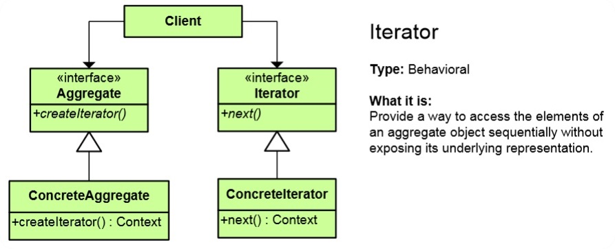

# Iterator Pattern

## Мотивация
Необходимостта от отделяне на логиката по обхождането на дадена структура от данни от логиката на самата структура

 
## Цел
* Достъп до елементите на сложен обект(колекция) без за това да е необходимо разкриването на имплементацията на този обект
* Съществуват различни начини обхождане на структури от данни
	* Детайлите по обхождането остават скрити
	* Алгоритмите по обхождането са взаимозаменяеми
* Предоставя унифициран абстрактен интерфейс за обхождане на различни видове структури от данни

## Приложение

Това е принципното имплементиране na **Iterator pattern** в езици извън .NET платформата.
Интерфейсът Iterator има метод next(), който ще дава всеки следващ елемент в колекцията. Класът ConcreteIterator имплементира конкретната логика на интерфейса за обхождане. Aggredate и ConcreteAggredate са, съответно, интерфейсът даващ ни абстракцията на колекцията и класът имплементиращ конкретната колекция.
 

## Известни употреби
В .NET **Iterator** шаблонът е директно имплементиран чрез интерфейс под наименованието **IEnumerator**. В резултат във всяка една колекция в .NET, която може да се обхожда е имплементиран този интерфейс. Цикълът за обхождане Foreach използва именно този шаблон. Ключовата дума yield генерира автоматично enumerator. 

## Имплементация в .NET
// Интерфейс на итератора

	public interface IEnumerator { // Iterator
	   bool MoveNext();
	   object Current { get; }
	   void Reset();
	}

Методът MoveNext() отива на следващият елемент в колекцията(следващият по индекс при линейните колекциии(масивите), или следващият наследник вляво/вдясно при дърветата). Пропъртито Current ни връща текущият елемент. Методът Reset()(ако е имплементиран, радко се използва) ни връща в началото на масива(при корена на дървото), ако сме използвали вече енумератора и искаме втори път да използваме същият енумератор. Прилича на Object Pool шаблона.

// Интерфейс на колекцията

	public interface IEnumerable { // Aggregate interface
	   IEnumerator GetEnumerator();
	}
IEnumerable е интерфейсът на колекцията, която (ще) може да бъде обхождана чрез методите на IEnumerator. Дава ни метод GetEnumerator(), който ни връща IEnumerator. По този начин самата колекция определя кой е нейният Enumerator

// Конкретен клас имплементиращ IEnumerator

	private class ConcreteEnumerator : IEnumerator {
	   // Implement IEnumerator interface
	}

Всяка колекция от този клас ще имплементира колекция IEnumerable  с обхождане IEnumerator

// Конкретна имплементация на клас за обхождане -  в случая foreach

	var enumerator = someObject.GetEnumerator();

	while (enumerator.MoveNext()) {
	   // work with enumerator.Current
	}

Използвайки програмният код

	foreach(var item in collection){
		// some code here
	}

**collection** фактически е обектът **enumerator**, който сме получили чрез **someObject.GetEnumerator()**, а **item** е това, което ни връща **enumerator.Current()**

