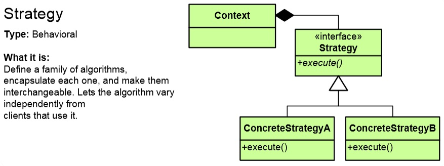

# Strategy Pattern

## Мотивация
Необходимостта от създаване на абстракция на алгоритъм.
 
## Цел
* Чрез интерфейс определяме входните данни и изходните данни на определн алгоритъм.
* Всички класове, които имплеменират този интерфейс определят как точно ще изглежда този алгоритъм
* **Strategy Pattern** спазва depenency-inversion принципа. Дадени класове зависят от дадена абстракция и това определя какви данни подаваме и съответно получаваме. Изнасянето на тези зависимости като конкретни параметри спазване на depenency-inversion принципа.

## Приложение
Известен code-smell при който е уместна употребата на **Strategy Pattern** е употребата на switch или if конструкции.

Имаме клиент(Context) който работи с интерфейса Strategy, който има две конкретни имплементации - ConcreteStrategyA и ConcreteStrategyB
 

## Известни употреби
В .NET се използва при Func or Delegates

## Имплементация

// В случая имплементираме **Sтrategy pattern** с помощта на абстрактен клас, а не на интерфейс

	abstract class SortStrategy {
	   public abstract void Sort(IList<object> list);
	}

// Следват два класа, които наследяват абстрактният клас и имплементират по различен начин метода Sort(). И в двата случая входните данни за метода са IList от обекти и изходните данни се записват в същата колекция.

	class QuickSort : SortStrategy {
	   public override void Sort(IList<object> list) { ... }
	}

	class MergeSort : SortStrategy {
	   public override void Sort(IList<object> list) { ... }
	}

// Клиентски клас

	class SortedList {
	   private IList<object> list = new List<object>();

	   public void Sort(SortStrategy sortStrategy) {
	      // sortStrategy can be passed in constructor

	      sortStrategy.Sort(list);
	   }
	}	

## Последствия
* Логиката ни започва да живее в отделни класове- спазваме separation of concerns(SoC) принципа.
* Кодът става лесен за тестване, като можем да изпозлваме и mocking
* Можем да добавяме нови strategies

## Сродни модели

## Проблеми

